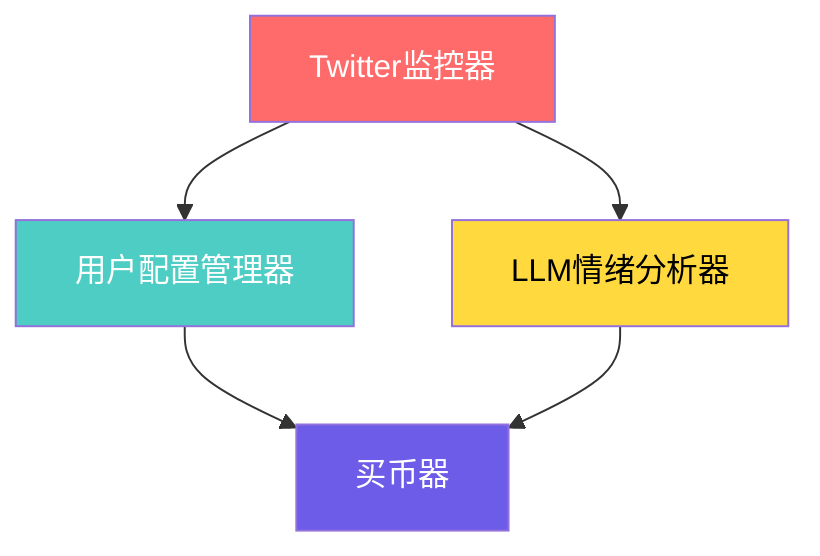

# Flow Based Programming - 从一个例子开始

从一个故事开始。公司希望制作一个AI编程框架，先从一个Demo开始，Demo包括以下组件：

1. Twitter监控器，监控例如Trump的推特。
2. 用户配置管理器。保存用户的配置，如用户的私钥（你没看错），用户感兴趣的大V。对于给定推特，找出所有关注的用户。
3. LLM情绪分析器。从推特中解析出这条推特，在支持买入/卖出哪些Token。
4. 买币器。根据用户配置、情绪分析，帮用户买币。

大概就是下面这个流程：

希望提供的能力是，分别实现这4个组件，用一个执行框架，通过配置自动执行他们。而我就在编写这个执行框架。

- 推特监控器：爬虫+消息队列（如RabbitMQ），一个Producer的角色。
- 用户配置管理器：input 消息， output 用户配置。做成一个RPC。参数都通过JSON传递。
- LLM情绪：input 消息， output 情绪。做成一个RPC。
- 买币器：input 用户配置+情绪， output 成功与否。做成一个RPC。

所以执行框架也很自然。首先设计一个DSL来让用户定义流程、节点输入输出，可以基于YAML修改。每一个组件，都单独起一个Task（线程/进程/协程）。组件之间，通过编程语言内置的消息队列传递消息。

例如：

- Producer: 不停的监听RabbitMQ，把消息发送到 用户配置和LLM的消息队列。
- RPC：一旦收到消息，发起RPC请求，将消息再发送给后面。

聪明的你看到这里，一定发现了问题：

1. 买币器依赖于两个组件，按照之前的做法岂不是收到任意一个就要发请求了，参数都填不上。我的做法是，消息队列中传递的消息是一个引用（Rust: `Arc<Mutex<Message>>`），称为 `Context`。
    - 如果买币器有两个消息Reciver，如果发现其中收到的消息不完整，说明依赖的组件还没执行完成。
    - Twitter监控器创建的`Context`，再经过用户配置管理器和 LLM情绪都处理后，就完整了。
2. 如果流程是一个环，岂不是执行不完？
    - 可以对DSL进行检查，让用户定义的流程图必须是有向无环图。

--- 

## Flow-based Programming

上面介绍的背景故事，对应的编程模型就是[Flow-based Programming](https://jpaulm.github.io/fbp/)。它包括几个基础元素：

- **组件（Component）**：独立的功能单元。在上面的例子中，就是买币器、LLM情绪分析等。
- **连接器（Connection）**：带类型的通信通道。在上面的例子中，用了编程语言内置的消息队列。
- **信息包（Information Packet，IP）**：数据传递单元。在上面的例子中，用了JSON。
- **网络定义（Network Definition）**：组件连接拓扑。在上面的例子中，就是那张图。

它有什么好处呢？它天然是异步消息驱动的，组件黑盒化松耦合。无共享内存。适合需要灵活重组处理流程的系统，可视化编程需求强烈的项目。不适合计算密集型任务。

有没有觉得它很像“低代码开发平台”。
