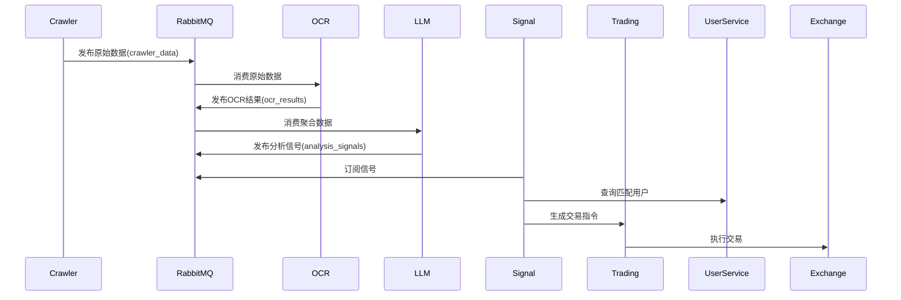

# 基于Golang生态的自动化交易系统架构设计文档

## 1. 技术选型

### 1.1 核心组件

|组件|技术方案|说明|
|---|---|---|
|消息队列|RabbitMQ|支持AMQP协议，成熟稳定，适合业务消息场景|
|Web框架|Gin|高性能HTTP框架，适合API服务开发|
|数据库|PostgreSQL + pgvector|支持JSONB存储用户配置，pgvector支持向量搜索|
|ORM框架|GORM|完善的ORM解决方案，支持PostgreSQL特性|
|分布式任务|Machinery|基于RabbitMQ的任务队列框架|
|配置中心|etcd|分布式键值存储，用于动态配置管理|
|服务发现|Consul|服务注册与发现|
|容器编排|Docker + Kubernetes|容器化部署和集群管理|

### 1.2 服务矩阵

|服务名称|技术栈|扩展方案|
|---|---|---|
|爬虫服务|Colly + Chromedp|支持分布式爬虫节点注册|
|OCR服务|Tesseract + OpenCV|GPU加速方案|
|LLM分析服务|Transformers + ONNX Runtime|支持多模型并行推理|
|交易执行服务|Binance API + Websocket|多交易所适配层|
|监控系统|Prometheus + Grafana|自定义业务指标采集|

## 2. 系统架构

### 2.1 整体架构图

```
+-------------------+     +-------------------+     +-------------------+
|   爬虫服务集群      |     |   OCR服务集群       |     |  LLM分析服务集群    |
| (Twitter/Telegram)|     | (图片转文字)        |     | (情感分析/事件提取)|
+-------------------+     +-------------------+     +-------------------+
          |                        |                          |
          v                        v                          v
+---------------------------------------------------------------+
|                         RabbitMQ Cluster                      |
|   Exchange: crawler_data   |   ocr_results   |   analysis_signals|
+---------------------------------------------------------------+
          |                        |                          |
          v                        v                          v
+-------------------+     +-------------------+     +-------------------+
|  数据清洗服务      |     |  特征工程服务      |     |  信号分发服务       |
| (数据标准化)       |     | (结构化处理)       |     | (策略匹配引擎)      |
+-------------------+     +-------------------+     +-------------------+
                                   |
                                   v
                         +-------------------+
                         |  交易执行服务集群  |
                         | (订单管理/风控)   |
                         +-------------------+
                                   |
                                   v
                         +-------------------+
                         |  交易所API网关     |
                         | (接口统一适配)     |
                         +-------------------+
```

### 2.2 核心模块交互流程



## 3. 详细设计

### 3.1 消息队列设计

#### 3.1.1 消息类型定义

```go
// 原始数据消息
type CrawlerMessage struct {
    Source      string    `json:"source"`     // twitter/telegram
    ContentType string    `json:"type"`      // text/image/video
    RawData     string    `json:"data"`      // 原始内容
    MediaURLs   []string  `json:"media_urls"` 
    Timestamp   time.Time `json:"timestamp"`
}

// OCR处理结果
type OCRResult struct {
    OriginalURL  string `json:"original_url"`
    TextContent  string `json:"text"`
    Confidence   float32 `json:"confidence"`
    Language     string `json:"language"`
}

// 分析信号
type AnalysisSignal struct {
    SignalID     string         `json:"signal_id"`
    SignalType   string         `json:"type"`      // bullish/bearish
    Confidence   float32        `json:"confidence"`
    RelatedCoins []string       `json:"coins"`
    Evidence     []EvidenceItem `json:"evidence"` // 支持依据
}

// 交易指令
type TradeCommand struct {
    UserID      string  `json:"user_id"`
    Action      string  `json:"action"`    // buy/sell
    CoinPair    string  `json:"pair"`      // BTC/USDT
    AmountType  string  `json:"amount_type"` // percentage/fixed
    AmountValue float64 `json:"amount"`
    Conditions  []Condition `json:"conditions"`
}
```

### 3.2 关键服务设计

#### 3.2.1 信号分发服务

```go
type SignalDispatcher struct {
    strategyCache *redis.Client      // 用户策略缓存
    userService   UserServiceClient  // gRPC客户端
    tradeQueue    amqp.Queue        // 交易指令队列
}

func (s *SignalDispatcher) HandleSignal(signal AnalysisSignal) {
    // 1. 通过向量搜索匹配相关币种
    relatedCoins := vectorSearch(signal.Embedding)
    
    // 2. 查询关注这些币种的用户
    users := s.userService.QueryUsersByCoins(relatedCoins)
    
    // 3. 匹配用户具体策略
    for _, user := range users {
        strategy := s.getUserStrategy(user.ID)
        matched := evaluateStrategy(strategy, signal)
        if matched {
            cmd := buildTradeCommand(user, strategy, signal)
            publishTradeCommand(cmd)
        }
    }
}

func evaluateStrategy(strategy UserStrategy, signal AnalysisSignal) bool {
    // 实现多条件匹配逻辑：
    // - 来源白名单
    // - 关键词匹配
    // - 置信度阈值
    // - 时间窗口限制
    // - 风险控制条件
}
```

#### 3.2.2 交易执行服务

```go
type TradeExecutor struct {
    exchangeClients map[string]ExchangeAdapter
    riskEngine      RiskEngine
    orderManager    OrderManager
}

func (t *TradeExecutor) Execute(cmd TradeCommand) error {
    // 1. 风险检查
    if err := t.riskEngine.Check(cmd); err != nil {
        return err
    }
    
    // 2. 选择最优交易所
    exchange := selectBestExchange(cmd.CoinPair)
    
    // 3. 转换订单类型
    order := t.createOrder(exchange, cmd)
    
    // 4. 执行并监控
    result := t.orderManager.Execute(order)
    
    // 5. 生成执行报告
    generateExecutionReport(result)
    
    return nil
}

func selectBestExchange(pair string) string {
    // 实现智能路由逻辑：
    // - 流动性分析
    - 费率对比
    - 用户偏好
    - 交易所健康状态
}
```

## 4. 接口设计

### 4.1 用户服务API

```go
// 用户策略配置接口
POST /api/v1/strategies
{
    "user_id": "uuid",
    "watch_list": {
        "twitter_users": ["elonmusk"],
        "telegram_groups": ["cryptosignals"],
        "keywords": ["merge", "halving"]
    },
    "actions": {
        "bullish": {
            "percentage": 30,
            "max_amount": 5000
        },
        "bearish": {
            "percentage": 50,
            "stop_loss": 10
        }
    }
}

// 实时信号查询接口
GET /api/v1/signals?coin=BTC&since=2023-07-01
Response:
{
    "signals": [
        {
            "id": "signal_123",
            "type": "bullish",
            "confidence": 0.92,
            "sources": ["twitter:elonmusk"],
            "timestamp": "2023-07-01T14:30:00Z"
        }
    ]
}
```

## 5. 扩展性设计

### 5.1 插件机制

```go
// 爬虫插件接口
type CrawlerPlugin interface {
    Name() string
    Init(config json.RawMessage) error
    Fetch() ([]CrawlerMessage, error)
    Validate(msg CrawlerMessage) bool
}

// 分析模块插件
type AnalyzerPlugin interface {
    Analyze(text string, images []OCRResult) (AnalysisSignal, error)
    Weight() float32  // 用于混合模型加权
}
```

### 5.2 动态配置

```toml
# crawler.toml
[twitter]
enabled = true
interval = "5m"
accounts = ["elonmusk"]

[telegram]
api_id = "YOUR_API_ID"
api_hash = "YOUR_API_HASH"
channels = ["cryptochannel"]
```

## 6. 监控与运维

### 6.1 监控指标

|指标类型|Prometheus指标名称|告警阈值|
|---|---|---|
|消息队列积压|rabbitmq_queue_messages_ready|>1000持续5分钟|
|OCR处理延迟|ocr_process_duration_seconds|P99 > 10s|
|信号准确率|signal_accuracy|< 0.8持续1小时|
|交易成功率|trade_success_rate|< 95%持续30分钟|

### 6.2 日志规范

```go
// 结构化日志示例
zap.Info("Trade executed",
    zap.String("user_id", "u123"),
    zap.String("exchange", "binance"),
    zap.Float64("amount", 1.5),
    zap.String("coin_pair", "BTC/USDT"),
    zap.Duration("latency", 230*time.Millisecond))
```

## 7. 安全设计

### 7.1 数据安全

- 用户API密钥：使用AES-GCM加密存储
- 通信加密：全链路TLS 1.3
- 敏感数据脱敏：日志过滤器处理关键字段

### 7.2 风控策略

```go
type RiskPolicy struct {
    MaxDailyLoss    float64 `json:"max_daily_loss"`   // 最大单日亏损
    PositionLimit   float64 `json:"position_limit"`  // 最大持仓
    CoolingPeriod   int     `json:"cooling_period"`   // 交易冷却时间（分钟）
    Blacklist       []string `json:"blacklist"`      // 高风险交易对
}
```

## 8. 部署方案

### 8.1 集群拓扑

```
+-----------------+       +-----------------+
|  Load Balancer  |       |   Consul Server |
+--------+--------+       +--------+--------+
         |                           |
+--------v---------+       +--------v--------+
|  API Gateway     |       |  Config Center  |
| (Rate Limiting)  |       |     (etcd)      |
+--------+---------+       +--------+--------+
         |                           |
+--------v---------+       +--------v--------+
|  Service Mesh   <-------+  Service Nodes  |
| (Istio)          |       | (自动注册发现)   |
+------------------+       +-----------------+
```

## 9. 演进路线

### 阶段演进计划

1. **MVP阶段**：核心流程贯通，支持基础信号触发
2. **扩展阶段**：增加交易所适配，完善风险控制
3. **智能阶段**：引入强化学习优化策略参数
4. **生态阶段**：开放策略市场，支持用户自定义插件

## 10. 性能优化

### 关键优化点

1. **消息批处理**：使用RabbitMQ的批量确认机制
2. **向量计算加速**：利用GPU进行embedding计算
3. **连接池管理**：

    ```go
    type ResourcePool struct {
        dbPool       *pgxpool.Pool      // PostgreSQL连接池
        redisPool    *redis.Pool        // Redis连接池
        httpClients  *fasthttp.PClient  // HTTP客户端池
    }
    ```

4. **缓存策略**：使用LRU缓存高频访问的用户策略

该架构设计充分考虑了松耦合、可扩展性和安全性，各组件可独立部署和扩展。建议实施时采用渐进式交付，优先构建核心管道，逐步增加高级功能。
