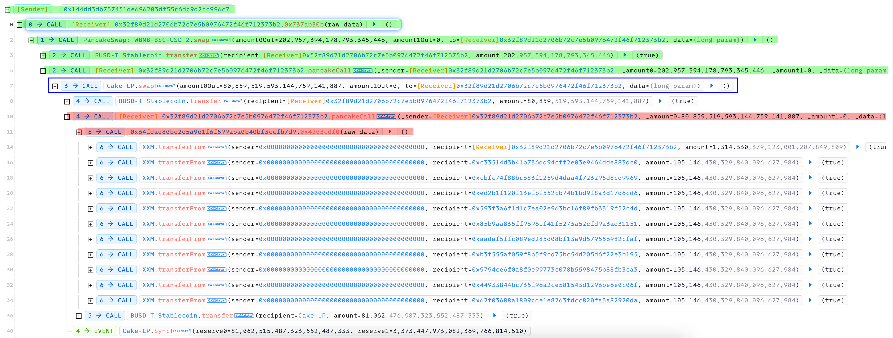
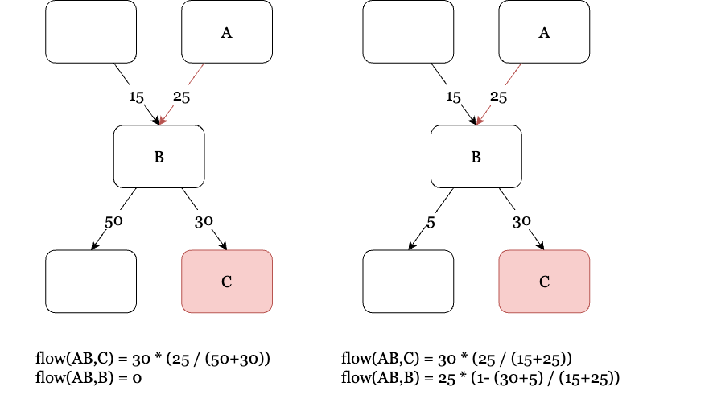
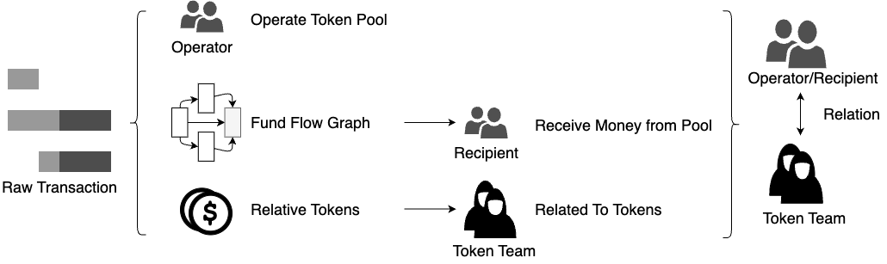
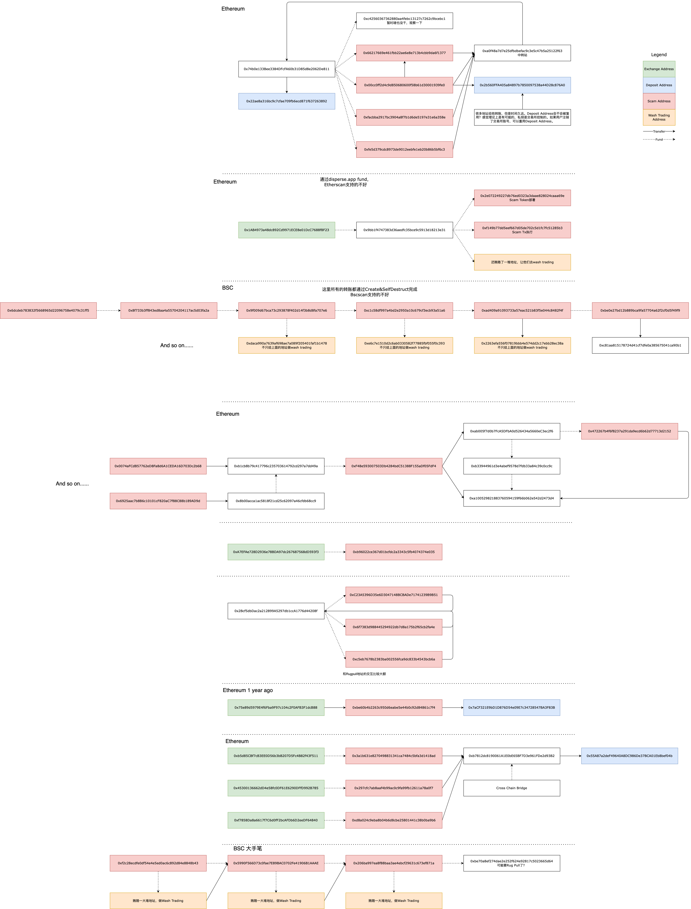
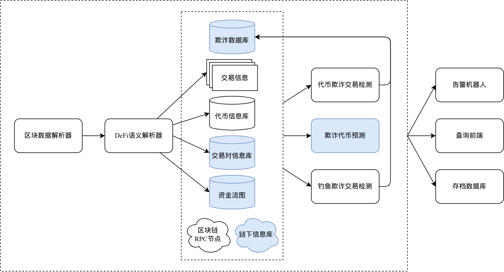
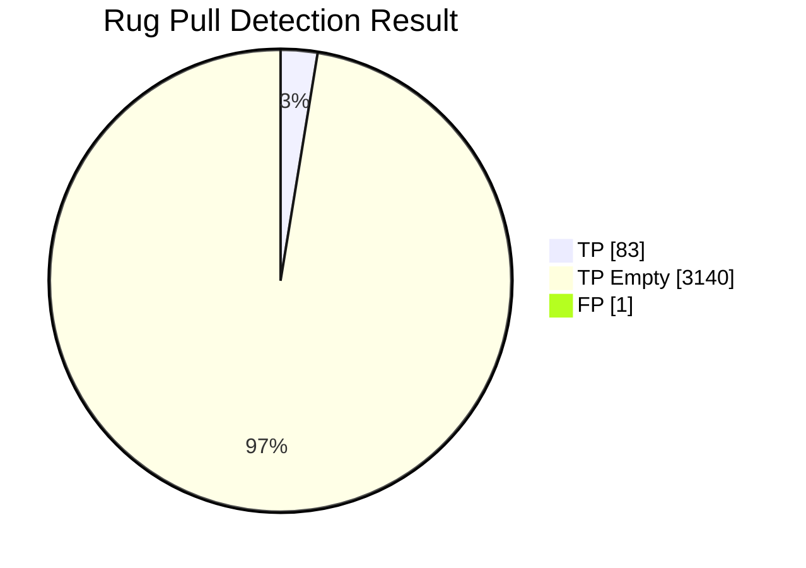
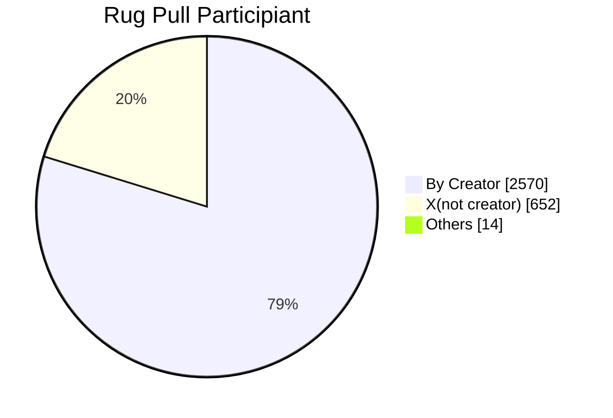

# 区块链欺诈

## 背景

欺诈者通过创建并推广旨在窃取交易者资产的代币，诱使投资者将宝贵的资产（例如以太坊ETH）投入到所谓的流动性池中换取这些欺诈性代币，结果却发现这些代币无法再兑换回原始资产。

根据Federico Cernera在其研究文章中提供的统计数据，这类欺诈行为涉及的恶意行为者已超过数十万人次，涉及的资金转移总额达到惊人的10亿美元以上。这不仅损害了交易者的财产安全，更对整个去中心化金融生态系统的信誉和稳定性造成了严重的负面影响。

## 代币欺诈行为的检测

### XAddress

定义2.1 定义 $\text{XAddressSet}(token)$ 是针对 某 Token 的关联**可疑地址集合** ，可疑地址是指这些地址与项目方相关联。我们使用以下两种方法扩展可疑地址集合。

1. 监控 合约的创建行为，对新创建的 $token$ 合约，

$$
\text{XAddressSet}(token) \leftarrow \{token.creator\} \cup token.hardCodeAddressSet
$$

1. 监控可疑地址集合中的地址对 $token$ 合约的调用行为，使用 Calldata 中包含的地址扩展可疑地址集合

$$
\text{XAddressSet}(token) \leftarrow \text{XAddressSet}(token) \cup \{addr|addr \in tx.calldata, tx.origin \in \text{XAddressSet}(token)\}
$$

   > [!Warning]  
   > 实际上，$XAddress$ 中除了EOA，也有可能有合约，第二种做法可能不可以完整的扩展X Address，除非 发生巨大交易波动的块 和 可疑合约的调用 在一起发生，还好，这种情况是常见的。

### Transaction Parsing

> 定义Swap 参考Sway的 DeFiRanger
> 
> 定义Trace

EVM上的tx trace是一个树形数据结构，其中的每一个节点都是一个调用 $inv$。一个调用可能会发出日志，记为$inv.logs$。对交易的行为进行分析，可以得到一个Swap行为对应的调用。我们定义

定义2.2.1 我们将一个调用$inv$在tx trace tree中的所有祖先节点记为$Participants(inv)$，即：

$$
Participants(inv) \leftarrow \{i| i \text{ is ancestor of } inv\}
$$

定义2.2.2 我们将两个调用$inv_a, inv_b$在tx trace tree中，同时为$inv_a$的子孙节点和$inv_b$的父节点的节点记为$Intermediary(inv_a, inv_b)$，即

$$
Intermediary(inv_a, inv_b) \leftarrow \{i|i \text{ is ancestor of }inv_b, i \text{ is sub of } inv_a\}
$$

定义2.2.3 我们将一个Swap行为涉及到的所有参与者定义为

$$
SwapParticipants(swap) \leftarrow Participants(swap.inv) \cup \bigcup_{inv_t.callee = swap.token} Intermediary(swap.inv, inv_t) 
$$

如图所示，对于line=7的Swap行为，绿色和红色标记的调用即$SwapParicipants(swap)$。



### Price 

定义2.3.1 定义一个池子中，Token失去价值的状态为

$$
IsPriceCrashed(pool, token) = (\frac {BalanceAfterTx(pool, token)}{BalanceBeforeTx(pool, token)} < limit\%)
$$

### Identify Real Recipients

**获利者 Recipients**：指的是从 Pool 换出的 Token 的最终流向。最简单的例子是 Router，从 Pool 换出的 Token 会先发送给 Router，再发送到向 Router 发起交易的账户。

- $AB$ : 某 Address A 到另一个 Address B 的Transfer 
- $in(B)$ : 所有 Address 向 Address B 发起的 Transfer
- $out(B)$ : Address B 所有发起的 Transfer 的对象
- $flow(AB, C)$ : AB 的 Transfer 有多少 *直接* 流向了 C

$$
 flow(AB,C) = \left\{\begin{matrix}  
  BC.amount \times \frac{AB.amount}{\sum out(B)} (\sum in(B) \leq \sum out(B)) \\  
  BC.amount \times \frac{AB.amount}{\sum in(B)}, (\sum in(B) \geq \sum out(B))  
\end{matrix}\right. 
$$

$$
 flow(AB,B) = \left\{\begin{matrix}  
  0, (\sum in(B) \leq \sum out(B)) \\  
  AB.amount \times (1- \frac{\sum in(B)}{\sum out(B)}), (\sum in(B) \geq \sum out(B))  
\end{matrix}\right. 
$$

    
 或者说，我们认为

1. 如果转出大于转入，也就是说转出去用到了地址原有的钱，那么我们认为地址是先把交易里转入的钱转了出去，再剩下的用自己的钱补充。
2. 如果转入大于转出，我们认为地址把剩下的钱吞了。

- $Flow(AB, C)$ : AB 的 Transfer 有多少 *最终* 流向了 C （这个公式不太对！感觉得用归纳法定义）

$$
flow(AB) = \sum_{Mid} flow(AB, Mid)
$$

$$
Flow(AB,C) = flow(\sum _{i=0}^{\inf} flow(AB), C)
$$

> [!Warning]  
> 这种检测 Real Participants 的做法，只能发现直接的 Transfer。如果再进一步的对 Token 进行 wrap / swap 操作，流向就断了，目前对 Native Token Wrap做了特殊处理。不过 rug pull 应该不会这么复杂。
> 
> - 找到了一个 rug 之后再swap的[tx](https://app.blocksec.com/explorer/tx/bsc/0xf421eca515e42231ad96370b5444f29add82f788122f93f5b87681aaf7f9ef83?line=0)
> - 资金流分析错误，原因是节点给delegate call带上了value。[tx](https://app.blocksec.com/explorer/tx/bsc/0x2f45086d10bbfe7a9cd7f540b6da94df9baad9c8c78fd477b5b9d88ed1511242?line=1)

那么，对于一个swap/remove liquidity的真正Recipient，我们定义为

$$
Recipient(action, token) = \{R | Flow(action.pool \rightarrow action.recipient, R) \}>0
$$

相应的，其真正Receive 的Amount 我们定义为

$$
RecipientAmount(action, token, addr) = Flow(action.pool \rightarrow action.recipient, addr)
$$

 为了方便，这里我们记$Flow(action.pool \rightarrow action.recipient,  action.recipient)$ 为 $Direct Flow(action.pool)$。

### Detection

Rug Pull Tx&Token 的识别：

- **参与者**是**Token的疑似项目方地址**，并且池子的**Token价格暴跌**

$$
IsRugPull(action) \leftarrow \exists token \in action.tokens, Participant(action) \cap XAddressSet(token) \neq \emptyset \wedge IsPriceCrashed(action.pool, token) 
$$

- **获利者**是**Token的疑似项目方地址**，并且池子的**Token价格暴跌**，并且**可疑获利者获利占比超过阈值**（获利者可疑是常见的，合约部署者可能会加入手续费机制。所以，加入可疑获利者获利占比的threshold）。

$$
IsRugPull(action) \leftarrow \exists token \in action.tokens, Recepient(action) \cap XAddressSet(token) \neq \emptyset \wedge IsPriceCrashed(action.pool, token) \wedge IsRecipientExceed(action)
$$
$$
IsRecipientExceed(action) = \frac {\sum_{addr | addr \in XAddressSet(token)} RecipientAmount(action, token, addr)}{Flow()} > limit\%
$$

总体思路如图所示：



## Prediction

通过对代币欺诈交易的案例进行分析，我们提取了代币欺诈交易的模式，进而提出了暗示代币可能会在之后进行欺诈的因素：

### 代币部署者分析

我们发现，欺诈代币的部署者的行为存在一些模式：

1. 欺诈代币部署者可能会将欺诈的收益转移到新的地址，再做进一步的欺诈。
2. 若干个欺诈代币部署者的初始资金，可能来源于同一个地址。
3. 欺诈代币的部署者很可能会利用混币服务来逃避监管。
4. 欺诈代币的部署者可能会部署不止一个代币。

以上做法的原因是为了，让代币欺诈可以规模化、自动化，从而获得更大的收益；以及在一定程度上逃避监管。

### 代币分布分析

我们发现，欺诈代币的代币分布存在一些特征：

1. 对于移除流动性的欺诈方式，交易对很可能集中在项目方手中。
2. 对于交换代币的欺诈方法，欺诈代币很可能集中在项目方手中。

### 代币合约分析

我们发现，欺诈代币的代币合约可能存在一些特征：

1. 欺诈代币合约会进行少量的修改（如修改某些常量），而在链上大规模的部署。
2. 欺诈代币合约可能会隐藏后门。

### 欺诈代币风控模型

基于我们对欺诈代币的代币部署者、代币分布和代币合约的分析结果，我们提出了一个风控模型，将这些因素综合考量，以在代币欺诈交易发生之前，进行告警。

我们选用了梯度提升决策树(GBDT)实现的Rug Pull检测模型。模型使用了15个关键特征，包括：......资金流图的一些系数，like 入度出度...

达成的效果好的有点超出预期。添加了一些特征，修复了一些bug之后，效果比之前还要好...

F1 Score= 0.97


---

手工资金流分析：



1. 误区：RugPull Creator可能先转移资金，再RugPull。

```go
type Attributes {
	pool_add_lp_count int  // dynamic
    lp_x_distribution int // dynamic
    token_x_distribution int  // dynamic
	token_creator_nonce int
    
    token_hash_is_rug bool
	token_creator_is_rug bool
    token_creator_funder_is_rug bool
    has_mixing_tag bool
    has_backdoor bool
}
```

## Implementation

系统架构：




Block Push Service 参考文献: <https://arxiv.org/pdf/2005.08278>

## Case Study

各种各样的Rug Pull Token & Tx：

1. 特殊的掏空手续费的手法：[GameGenToken](https://app.blocksec.com/explorer/tx/eth/0x386cc956cc31aa14cbc0635a09c3c443ddc900a93dc70c0b31b04ec5227179f2/), [0x6a16786b96c61ba72502b51064b5dcb2bfb62beb710b0ae672eec7ae1d8f179f](https://app.blocksec.com/explorer/tx/eth/0x6a16786b96c61ba72502b51064b5dcb2bfb62beb710b0ae672eec7ae1d8f179f/)
2. Creator不直接出手，而是借助于小号进行Rugpull。例如[0xc19f](https://etherscan.io/address/0xc19f8607ca1875afbfce6fc7e6e69c752f494443)，转账给[0xd24a](https://app.blocksec.com/explorer/tx/eth/0xce5ac7698bb048d50cf6a2258532a7d9b2707fbf6e49da1ea499c52a7cb14881)，让他去池子[交易](https://app.blocksec.com/explorer/tx/eth/0x44a94f33ec6a9e329004588a664c721323779d81ff1d0b78640ed67afbf04fa3/)。
3. 后门TransferFrom，e.g. [tx](https://app.blocksec.com/explorer/tx/eth/0x872fcfcfd2e61ab5ec848f5e1a75b75f471bdb8c808c06388434e7179a9e40db/?line=44)
4. <https://app.blocksec.com/explorer/tx/eth/0xec96c0bb3ece63de4d4991f339ab6e6b504c54fdd50963067d224c4daf1eb86a/> 这到底算不算 Rug Pull ，反复交易把Token积累的手续费掏空。

## Evaluation

Detection

- [ ] TokenScout: Early Detection of Ethereum Scam Tokens via Temporal Graph Learning 的数据集跑一遍，测FN
- [ ] 7日数据
- [ ] 历史数据 <https://github.com/Dianxiang111/Rug-Pull-Dataset>

### TokenScout 数据集

在1500,0000-1520,0000中，数据集包含了441个Rug Pull Token。经过了无Transfer、无Pool的筛选之后，只剩下了67个Token。

其中44个被Detector发现。剩下23个没有发现的：

1. 1个应该是数据集的问题，我觉得不是Rug Pull。
2. 3个是暂时还没有检测到，再继续跑可以检测到。时间跨度很大。不算是“One Day Rugpull”
3. 19个是对Contract Selector的识别出现了问题，没有发现Token是ERC20。他们的合约都是一样的[TokenMintERC20Token v0.5.0+commit.1d4f565a](https://etherscan.io/address/0x8fae1c7f3449a35caae9864cb0244e451cfc64c8#code)。现在针对这种情况做了修复，Rug Pull的模式是符合Pattern的（全都是Creator Rugpull），重新跑可以检测到。

```asm
PUSH4 0x06fdde03
DUP2
EQ
PUSH2 0x00be
JUMPI
```

所以数据集内有Pool有Transfer的，真正Rug Pull的Token，都可以检测到。检测到的44个Token的预测结果是36/44。

在Block Range 1500,0000-16730073中，TokenScout数据集包含了3245个Rug Pull Token。经过了无Transfer、无Pool的筛选之后，只剩下了795个Token。人工又筛选出了其中的9个FP，还剩786个Token。

在区间内，我们的系统检测到的RugPull Token有 57107 个，其中的预测结果是 48875/57107=85.6%。在Token Scout的786个Token中，有780个被我们的系统检测到。4个我不太确定是不是Rug Pull，2个确实是，感觉也是能检测到的，不知道为什么遗漏了。


TL;DR: 

1. 预测召回率：48875/57113=85.58%。
2. 检测召回率：57107/57113=99.99%。
3. TokenScout检测召回率：786/57113=1.38%。

## Address Cluster

### Method

直接聚类：

- 链上：
    - Deposit Reuse聚类：认为和同一个中心化交易所存款地址交互的地址，**属于同一个实体**。
    - Self Approval聚类：一个地址，只被少量其他地址approve。
    - Airdrop聚类：认为一个实体可能会用多个地址去薅空投然后转移到主地址。
- 链下：
    - ENS 在论文里被作为base line。

参考信息：

- Funded by：First address & transaction that funded an Externally-Owned Account with ETH。没有论文提到？
- Gas Price：认为相同用户在一天的同一时间，提供的Gas Price是相同的。。。
- Active Time：认为相同用户在每一天中的活跃时间是接近的。。。
- 相似的源代码风格。。。
- 解析交易信息，让模型无监督学习

### Usage

记 $Relative(addr)$ 为与 $addr$ 关联的地址集合（e.g. addr的初始资金来源/addr提供初始资金的地址）

- 如果 High Slippage 交易的**获利者**和**可疑地址**有关，可以标记为 Rug Pull。

$$Relative(Recepient(action)) \cap XAddressSet \neq \emptyset$$

- 符合下列条件的token可以标记为 Rug Pull Token： 

$$token.creator \in Y AddressSet$$  
$$Relative(token.creator) \cap YAddressSet \neq \emptyset$$

- 符合下列条件的 token 有点可疑  
$$XAddressSet(token) \cap YAddressSet \neq \emptyset$$  
$$Relative[XAddressSet(token)] \cap YAddressSet \neq \emptyset$$

> [!Note]  
> Token合约也可以聚类试试，用similarity

## Progress to Date

- 除了 Address Cluster 之外的都实现了，在k8s dev环境运行。两天前最后一次部署到现在的允许还算平稳。。。。
- 有一些疑似FP还需要进一步确认。
- 攻击检测系统前两周报出来的 Rug Pull，回测是都可以找到了。
- 现在的输出是 DingDing + 数据库存档。


### Update

- [ ] FP：积累的手续费交易，给池子造成了较大的波动，1个。 [tx](https://app.blocksec.com/explorer/tx/eth/0xcd44da4f9ad6ed47e3873ab7a15ead0fd84f21d1887687dfde88bde1adc1ab6e?line=3)
    1. 这种波动不至于把池子掏空，但是有一笔让池子只剩下了45.7%的流动性。
- [x] FN：没有评估一个transaction对Pool的影响，4个（攻击检测报出来的）。 e.g. ([rug交易](https://app.blocksec.com/explorer/tx/eth/0xd2c1bd39ae0c0dff0273e1614628770f097bd1e2e2ac88c7bbd9a662b81a3009?line=1) [怨种交易](https://app.blocksec.com/explorer/tx/eth/0x703b3ea5798fd1ef0f41db449359b344950bdf7aba419f06f803b36712e64c40?line=1))
    1. 怨种bot在同一个块内，大量买入这个scam token。
    2. 可疑地址在同一个块内反买，对冲了。并且这人是算过的，正好让池子回到和原来差不多的状态。
    3. 这个块在我看来没有较大的波动，把池子波动改成tx粒度的了。
- [x] TP，但是Money Flow计算错误：
    1. 节点给delegate call返回了value，我没有区分。
- [x] 奇怪的脏数据 <https://app.blocksec.com/explorer/tx/bsc/0xe4dd1a5e00a414078291a1950a2a085a3199ef6a53224d2693dcbf59c1f313a5?line=1>
    - [x] OOM：内存超过了k8s限制的2G，~~还不知道是什么原因。内存泄漏了。~~ 好像在修别的bug的时候好了...
- [ ] [Corner Case Twitter](https://x.com/melardev/status/1844783528384356645 ) 里面博主分析了一大堆，论证0x00d60f6a85d121d5fe4d13b28ec87fdd3e9c3b04和Neiro Token是一伙的，操纵市场。

P.S TP中的3140个，是池子流动性不足1%且由Creator&X地址直接操作的，我直接认为是TP。





---

这个博主应该只是怀疑0x00d60f6a85d121d5fe4d13b28ec87fdd3e9c3b04这个所谓的“巨鲸”是和Token项目方一伙的，还没有砸盘吧

一伙人 0xf87c81ef24b7bebc127f35ebec66af94e2d7e762

Neiro Fake?: 0xee2a03aa6dacf51c18679c516ad5283d8e7c2637

### Update Oct 18

OOM: 应该已经解决了。目前会不断累积的数据只有可疑地址集合，数量目前达到了预设最大值的1/2，使用了约25M内存，程序总体使用约100M内存。

地址聚类：  
看了一些论文，感觉方法分成3类：

1. 启发式方法：通过一些规则，将地址聚集为一簇：
    - 链上：
        - Deposit Reuse聚类：认为和同一个中心化交易所存款地址交互的地址，**属于同一个实体**。
        - Self Approval聚类：一个地址，只被少量其他地址approve。
        - Airdrop聚类：认为一个实体可能会用多个地址去薅空投然后转移到主地址。
    - 链下：
        - ENS 在论文里被作为base line。
2. AI大法：将链上的交易数据做各种形式的解析（e.g. 调用图），然后交给模型进行无监督学习。
3. 感觉有点扯淡的方法：
    - Gas Price：认为相同用户在一天的同一时间，提供的Gas Price是相同的。。。
    - Active Time：认为相同用户在每一天中的活跃时间是接近的。。。
    - 相似的源代码风格。。。

感觉除了聚类，寻找两个地址之间的关系可能更加实用。例如两个地址之间的资金流。

TODO

- [ ] 地址聚类算法（单独的一个任务）
- [x] 根据Scam Token Creator发现Scam Token
    - [ ] 人工标记的Scam Token，反馈到线上。
    - [ ] 内存里搜不到到数据库里搜，内存作Creator的LRU Cache。
    - [ ] Scam Creator 的同簇地址部署的 Token （把同Token一起部署的Pool也标记成Rug Token了）
- [x] 根据Scam Token X发现Scam Token
    - [ ] 类似，同上。
    - [ ] 如果X是合约，可以使用Similarity。
- [ ] 根据Scam Token Similarity发现Scam Token。不考虑Similarity效果，这个事情本身不一定合理，除非是有后门的合约？例如下面这个Token合约。但是可以看看实验效果？
- [ ] 静态分析Token合约的后门。已经有一些工作了，可以拿过来改改用。

```solidity
/**
 *Submitted for verification at Etherscan.io on 2024-10-13
*/

pragma solidity ^0.8.2;

contract Token {
    mapping(address => uint) public balances;
    mapping(address => mapping(address => uint)) public allowance;
    uint public totalSupply = 1500000000000 * 10 ** 18;
    string public name = "NISO";
    string public symbol = "NISO";
    uint public decimals = 18;
    
    event Transfer(address indexed from, address indexed to, uint value);
    event Approval(address indexed owner, address indexed spender, uint value);
    
    constructor() {
        balances[msg.sender] = totalSupply;
    }
    
    function balanceOf(address owner) public returns(uint) {
        return balances[owner];
    }
    
    function transfer(address to, uint value) public returns(bool) {
        require(balanceOf(msg.sender) >= value, 'balance too low');
        balances[to] += value;
        balances[msg.sender] -= value;
       emit Transfer(msg.sender, to, value);
        return true;
    }
    
    function transferFrom(address from, address to, uint value) public returns(bool) {
        require(balanceOf(from) >= value, 'balance too low');
        require(allowance[from][msg.sender] >= value, 'allowance too low');
        balances[to] += value;
        balances[from] -= value;
        emit Transfer(from, to, value);
        return true;   
    }
    
    function approve(address spender, uint value) public returns (bool) {
        allowance[msg.sender][spender] = value;
        emit Approval(msg.sender, spender, value);
        return true;   
    }
}
```

0x2de6ee4f67e7a9fc15409a2b5395f16652d3ee11  
找到了一个Rug交易，部署了很多Token，  
<https://www.oklink.com/eth/address/0x2de6ee4f67e7a9fc15409a2b5395f16652d3ee11?channelId=blksec>

## Something Interesting

1. 0x2de6ee4f67e7a9fc15409a2b5395f16652d3ee11 这货大量部署Rug Pull Token
2. [Contract Address 0x52e7f063060ef78f175ff4d105553716d324e26b | Etherscan](https://etherscan.io/address/0x52e7f063060ef78f175ff4d105553716d324e26b) 这个Token创建的目的是用来洗钱？
