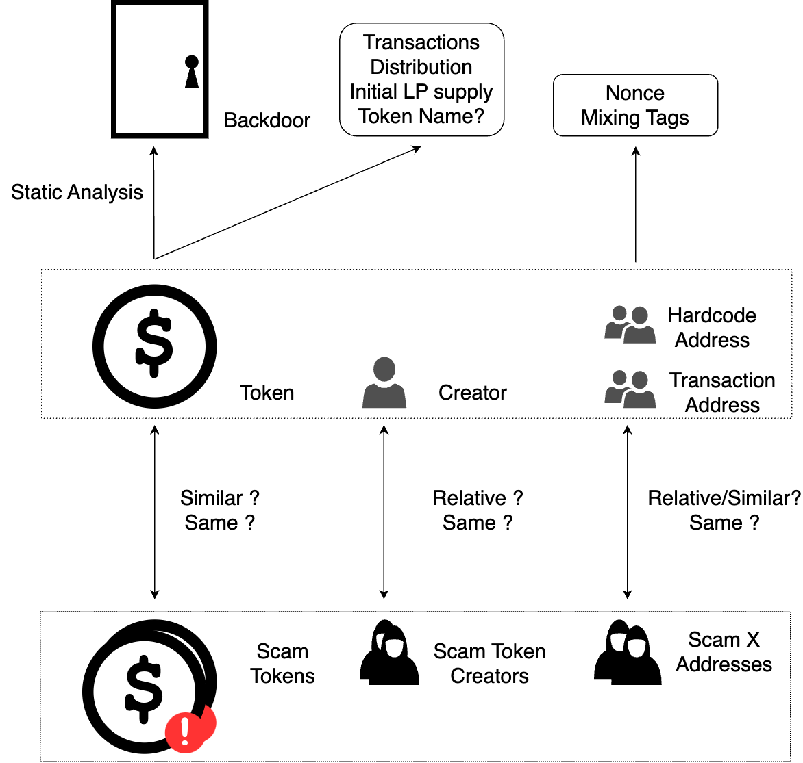

# 区块链代币欺诈行为的检测和预防

## 选题依据

### 课题来源

本课题源于当前去中心化金融（DeFi）领域中日益严重的一个现实问题——代币欺诈行为的猖獗。这些欺诈行为不仅破坏了数字金融系统的完整性，还对投资者构成了重大风险，因此迫切需要对此进行深入研究，并开发出有效的防范措施。

### 课题的研究意义

去中心化交易所（Decentralized Exchanges, DEXs）构成了去中心化金融（Decentralized Finance, DeFi）领域的核心基础设施之一，并通常被认为优于中心化交易所（Centralized Exchanges, CEXs）在于其增强的可靠性。然而，尽管存在这种普遍看法，一些领先的去中心化交易平台如Uniswap却允许任何未经审计的ERC20代币在其平台上自由部署。这种开放性策略虽然符合去中心化精神，但也无可避免地引发了大量的欺诈活动。具体而言，欺诈者通过创建并推广旨在窃取交易者资产的代币，诱使投资者将宝贵的资产（例如以太坊ETH）投入到所谓的流动性池中换取这些欺诈性代币，结果却发现这些代币无法再兑换回原始资产。

根据Federico Cernera在其研究文章中提供的统计数据，这类欺诈行为涉及的恶意行为者已超过数十万人次，涉及的资金转移总额达到惊人的10亿美元以上。这不仅损害了交易者的财产安全，更对整个去中心化金融生态系统的信誉和稳定性造成了严重的负面影响。

鉴于此，本研究课题的主要目的是归纳并总结这种代币欺诈行为的模式及其特征，基于此进一步开发出一套创新的代币欺诈交易监测系统以及针对欺诈代币合约的检测系统。这些系统的设计旨在通过先进的算法和分析技术，实时监测和识别潜在的欺诈行为，为DEX平台提供强有力的安全保障措施，从而保护投资者资产安全，维护DeFi生态系统的公正性和透明度。

### 国内外研究现状分析

学术界对欺诈性代币的研究主要集中在两个方面：实证分析和检测策略的开发。

实证分析调查了各种区块链平台上欺诈性代币的模式和影响，为欺诈性代币提供了重要见解。Xia等人对Uniswap上的欺诈代币进行了启发式收集，分析了欺诈代币的行为特点。Cernera等人对Binance Smart Chain上的欺诈行为进行了分析，发现欺诈代币的欺骗对象不只是人，还有交易机器人。Sun等人对代币欺诈行为进行了归纳总结，综合了很多不同的工作给出了较为完善的欺诈交易数据库。

当前的检测策略则多使用机器学习、模糊测试或静态分析等方式，旨在预先识别欺诈代币。Nguyen等人提出了基于特征工程等监督学习方法来检测欺诈代币，Hu等人使用预训练的Transformer对以太坊的数据进行分析，检测欺诈行为；Cao等人通过模糊测试来检测代币合约中是否存在操纵代币价格的方法，Tokeer, CRPWarner, Pied-Pier等工具分析了欺诈代币合约中常见的后门类型，在此基础上开发了针对后门的静态分析工具；然而，代币想要完成欺诈行为，不一定要在合约中添加后门。除了对代币合约进行分析，Mazorra等人通过机器学习分析代币在Uniswap中的交易模式，来预测恶意代币。

在地址聚类方面，Victor等人提出了基于启发式规则将属于同一个实体控制的地址进行聚类。Zhou等人利用图神经网络对对交易数据进行分析，尝试对以太坊地址进行去匿名化。尽管相关的工作提出了不同的解决办法，但是地址聚类依然是一个开放性的问题。

工业届的 GoPlus Security、TokenSniffer、RugPullDetector 等工具通过审计代币合约的源代码来检查代币安全性。其中一些工具可以覆盖对多种欺诈性代币风险的检测。然而,这些工具过度依赖合约源代码和已知的欺诈性代币模式，容易受到源代码级混淆的影响，并且无法覆盖复杂的代码结构。

### 主要参考文献

- Cernera, Federico, Massimo La Morgia, and Alessandro Mei. “Token Spammers, Rug Pulls, and Sniper Bots: An Analysis of the Ecosystem of Tokens in Ethereum and in the Binance Smart Chain (BNB),” n.d.
- Lin, Zewei, Jiachi Chen, Jiajing Wu, Weizhe Zhang, Yongjuan Wang, and Zibin Zheng. “CRPWarner: Warning the Risk of Contract-Related Rug Pull in DeFi Smart Contracts.” IEEE TRANSACTIONS ON SOFTWARE ENGINEERING 50, no. 6 (2024).
- Ma, Fuchen, Meng Ren, Lerong Ouyang, Yuanliang Chen, Juan Zhu, Ting Chen, Yingli Zheng, Xiao Dai, Yu Jiang, and Jiaguang Sun. “Pied-Piper: Revealing the Backdoor Threats in Ethereum ERC Token Contracts.” ACM Transactions on Software Engineering and Methodology 32, no. 3 (July 31, 2023): 1–24. <https://doi.org/10.1145/3560264>.
- Sharma, Trishie, Rachit Agarwal, and Sandeep Kumar Shukla. “Understanding Rug Pulls: An In-Depth Behavioral Analysis of Fraudulent NFT Creators.” ACM Trans. Web 18, no. 1 (October 11, 2023): 8:1-8:39. <https://doi.org/10.1145/3623376>.
- Sun, Dianxiang, Wei Ma, Liming Nie, and Yang Liu. “SoK: Comprehensive Analysis of Rug Pull Causes, Datasets, and Detection Tools in DeFi.” arXiv, March 24, 2024. <http://arxiv.org/abs/2403.16082>.
- Torres, Christof Ferreira, Mathis Steichen, and Radu State. “The Art of The Scam: Demystifying Honeypots in Ethereum Smart Contracts,” n.d.
- Xia, Pengcheng, Haoyu wang, Bingyu Gao, Weihang Su, Zhou Yu, Xiapu Luo, Chao Zhang, Xusheng Xiao, and Guoai Xu. “Trade or Trick? Detecting and Characterizing Scam Tokens on Uniswap Decentralized Exchange.” arXiv, November 11, 2021. <http://arxiv.org/abs/2109.00229>.
- Zhou, Yuanhang, Jingxuan Sun, Fuchen Ma, Yuanliang Chen, Zhen Yan, and Yu Jiang. “Stop Pulling My Rug: Exposing Rug Pull Risks in Crypto Token to Investors.” In Proceedings of the 46th International Conference on Software Engineering: Software Engineering in Practice, 228–39. ICSE-SEIP ’24. New York, NY, USA: Association for Computing Machinery, 2024. <https://doi.org/10.1145/3639477.3639722>.
- “SoK: Decentralized Exchanges (DEX) with Automated Market Maker (AMM) Protocols | ACM Computing Surveys.” Accessed October 11, 2024. <https://dl.acm.org/doi/abs/10.1145/3570639>.
- “Why Trick Me: The Honeypot Traps on Decentralized Exchanges | Proceedings of the 2023 Workshop on Decentralized Finance and Security.” Accessed October 11, 2024. <https://dl.acm.org/doi/abs/10.1145/3605768.3623546>.
- Cao, Mingpei, Yueze Zhang, Zhenxuan Feng, Jiahao Hu, and Yuesheng Zhu. “TokenAuditor: Detecting Manipulation Risk in Token Smart Contract by Fuzzing.” In _2022 IEEE 22nd International Conference on Software Quality, Reliability and Security (QRS)_, 651–62. Guangzhou, China: IEEE, 2022. [https://doi.org/10.1109/QRS57517.2022.00071](https://doi.org/10.1109/QRS57517.2022.00071).
- Hu, Sihao, Zhen Zhang, Bingqiao Luo, Shengliang Lu, Bingsheng He, and Ling Liu. “BERT4ETH: A Pre-Trained Transformer for Ethereum Fraud Detection.” In _Proceedings of the ACM Web Conference 2023_, 2189–97. Austin TX USA: ACM, 2023. [https://doi.org/10.1145/3543507.3583345](https://doi.org/10.1145/3543507.3583345).
- Victor, Friedhelm. “Address Clustering Heuristics for Ethereum.” In _Financial Cryptography and Data Security_, edited by Joseph Bonneau and Nadia Heninger, 12059:617–33. Lecture Notes in Computer Science. Cham: Springer International Publishing, 2020. [https://doi.org/10.1007/978-3-030-51280-4_33](https://doi.org/10.1007/978-3-030-51280-4_33).
- Zhou, Jiajun, Chenkai Hu, Jianlei Chi, Jiajing Wu, Meng Shen, and Qi Xuan. “Behavior-Aware Account De-Anonymization on Ethereum Interaction Graph.” _IEEE Transactions on Information Forensics and Security_ 17 (2022): 3433–48. [https://doi.org/10.1109/TIFS.2022.3208471](https://doi.org/10.1109/TIFS.2022.3208471).

## 研究方案

### 研究目标、内容和拟解决的关键问题

本研究有三个研究目标：

1. 对代币欺诈行为进行系统的归纳总结。
2. 提出一种代币欺诈交易监测系统。当检测到链上发生代币欺诈交易时，进行预警。
3. 提出一种欺诈代币合约检测系统。当检测到链上有疑似欺诈代币部署时，进行预警。

为了完成这三个研究目标，研究内容包括

1. 调研现有文献，梳理已有的代币欺诈行为分类方法。
2. 总结不同类型代币欺诈的特点、实施方式和危害，在此基础上建立代币欺诈交易监测系统，根据监测系统的结果，反复迭代对代币欺诈行为的认识，改进监测系统。
3. 基于监测系统的结果,收集和标注已知代币欺诈交易的链上数据,构建高质量的数据集。深入分析欺诈交易的链上特征,如交易模式、金额、频率等。在实证研究的基础上,进一步加深对代币欺诈行为的认知,对代币欺诈手段的发展趋势进行分析和预测。
4. 设计并实现基于静态分析、动态分析、地址聚类等的欺诈代币合约检测方法，为用户预警欺诈代币信息。

为此，需要解决的关键问题包括：

1. 现有的欺诈代币交易数据集规模有限，难以全面反映链上真实的欺诈情况。如何在有限的数据集基础上，设计有效的欺诈交易检测规则和策略，提高检测的覆盖范围。
2. 欺诈手段不断演化，单一特征难以准确判断欺诈交易和欺诈合约。需要探索多维度、多指标综合分析的检测方法，提高检测系统应对新型欺诈的能力。同时，还要持续跟踪欺诈手段的发展变化，及时更新检测规则。
3. 正常交易与欺诈交易在某些特征上可能存在相似性，导致误报情况的发生。需要深入研究正常交易和欺诈交易的区分边界，优化检测算法，提高系统的精准度，降低假阳性率。
4. 海量交易数据给检测系统带来了计算和存储压力。需要在算法设计上追求时间和空间效率,并充分利用分布式计算、并行处理等技术手段,提升系统性能。
5. 欺诈合约的代码实现多种多样，需要准确的提取和表示欺诈代币合约的关键特征，设计有针对性的监测方法，并具有一定扩展性，以应对新型欺诈手段。

### 拟采取的研究方法、技术路线、试验方案及可行性分析

为实现预设的研究目标，本研究拟综合运用以下技术：

1. 交易分析技术：通过对区块链交易数据的解析，提取交易中蕴含的高阶DeFi语义信息，挖掘欺诈代币的流转模式和用户行为特征，为欺诈交易的识别提供依据。
2. 地址聚类技术:运用基于交易关系和行为特征的聚类算法,将隶属于同一控制主体的多个地址进行归类,揭示欺诈代币背后的幕后操纵者,为潜在欺诈合约的识别提供重要线索。
3. 智能合约相似度分析技术:通过源代码、字节码、控制流图等多层次的相似度度量和比较,发现功能相近或代码相似的智能合约,识别出潜伏的欺诈合约,有效扩大欺诈合约的检出范围。
4. 智能合约静态分析技术:综合运用符号执行、数据流分析、控制流分析等程序分析技术,对智能合约进行全面的语法语义检查,精准识别合约中隐藏的后门、权限缺陷等欺诈风险点。

图1 代币欺诈交易检测

图一展示了代币欺诈交易检测的方法流程。首先，通过对区块链上的交易数据进行语义化解析，我们可以提取出与交易相关的代币信息、资金流向图以及操作地址。进一步的分析将揭示代币价格的波动情况以及资金的流向。通过比对疑似代币团队地址与资金流向人的交易记录和交易操作者的信息，我们可以评估该交易是否涉及代币欺诈行为。

图2 欺诈代币合约检测

图二展示了欺诈代币合约检测的思路。

1. 使用静态分析的方式，对代币合约中隐藏的后门进行分析。
2. 使用地址聚类和合约相似度分析的方式，将新部署的代币和已知的欺诈代币进行分析比对。
3. 使用交易分析的方式，对代币的交易、分布进行分析。
4. 使用账户的混币情况和交易数量，分析账户的潜在风险。

上述技术均已在区块链安全、程序分析等领域得到广泛研究和应用，具有成熟的理论基础和实践案例。这为本研究的顺利开展提供了坚实的技术保障和经验参考，极大地提高了研究成功的可能性和结果的可信度。

### 研究的创新点

本研究的创新点有：

1. 本研究提出了一种集成多种特征分析方法的代币欺诈交易检测框架，较现有方法实现了更广的覆盖范围和更高的检测精度。由此构建了一个全面的代币欺诈交易数据集，涵盖了各类典型的欺诈手法。
2. 本研究提出了一种基于图神经网络的智能合约相似度分析算法。该算法将合约代码抽象为语法依赖图，通过图卷积操作学习合约的语义表示，在欺诈合约检测任务上取得了优于传统方法的效果。此外，所提出的相似度分析算法还可用于合约克隆检测、合约漏洞检测等智能合约分析场景，具有一定的通用性。
3. 本文提出了一种新的基于交易模式、资金流向、代码调用的地址聚类算法，改进了已有研究的地址聚类算法可解释性差、计算开销大等问题。所提出的地址聚类算法还可用于钓鱼检测，反洗钱分析等工作。

### 研究计划及预测进展

1. 2024年10月前，调研和收集近年来关于代币欺诈的学术和行业报告，总结和归纳代币欺诈的类型和特点。初步筛选和标注数据，建立初步的欺诈交易数据集。
2. 2025年6月前，根据第一阶段收集的数据和文献回顾结果，设计初步的代币欺诈交易监测规则和算法。实现监测系统的原型，并在实际数据上进行测试。利用程序分析、地址聚类等方法，检测欺诈合约。根据测试结果不断进行系统迭代。
3. 2025年10月前，对系统进行全面评估，包括准确率、召回率和实时性等。整理研究成果，撰写学术论文。

### 预期研究成果

1. 代币欺诈类型和特征的系统整理：通过文献回顾和开发的检测系统，提供一份关于代币欺诈类型和行为特征的详尽报告，为学术界和业界提供研究基础。
2. 欺诈模式和行为识别框架：建立一个理论框架，用于识别和分类不同类型的代币欺诈行为，增强对新出现欺诈手段的理解和应对。
3. 代币交易监测系统：开发一个能实时监测和警报可疑代币交易的系统，该系统将利用最新的数据分析技术，提高欺诈检测的准确性和效率。
4. 欺诈代币分析工具：创建一个风控体系，综合程序分析和链上交易信息，对潜在的欺诈代币进行识别。

## 研究基础

### 与本项目有关的研究工作积累和已取得的研究工作成绩（报告者本人的单独列出）

与本项目有关的基础性的研究工作积累有以下部分，均为本人完成：

1. 对相关文献、已披露的代币欺诈事件的归纳总结。
2. 对以太坊虚拟机执行的区块、交易的解析。
3. 对以太坊交易的部分DeFi语义化解析。
4. 对智能合约代码相似度的分析工作。

在这些基工作积累的基础上，根据对现有的欺诈交易数据的归纳总结，完成了初步的代币欺诈交易监测系统，稳定运行并实时监测以太坊上的交易，积累了一些多欺诈交易数据。

### 已具备的实验、资料等条件，尚缺少的实验、资料条件和拟解决的途径

已具备必要的计算硬件、软件。实验室运行区块链节点，可以实时获取最新的区块数据。
