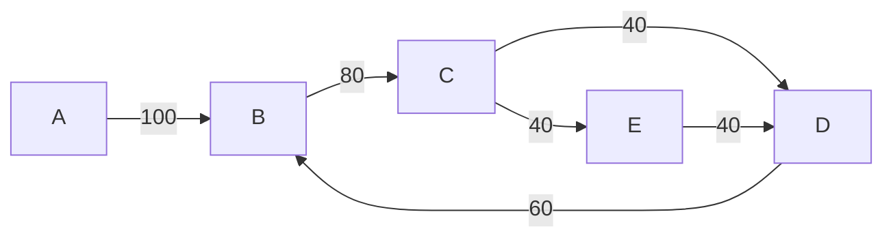

# 最大流

网络（network）是指一个特殊的有向图 $G=(V,E)$，其与一般有向图的不同之处在于有容量和源汇点。

- $E$ 中的每条边 $(u, v)$ 都有一个被称为容量（capacity）的权值，记作 $c(u, v)$。当 $(u,v)\notin E$ 时，可以假定 $c(u,v)=0$。
- $V$ 中有两个特殊的点：源点（source）$s$ 和汇点（sink）$t$（$s \neq t$）。

> [!NOTE]
> 如果存在多个源点和汇点，可以视作有一个不存在的超级源点和超级汇点。

最大流问题：对于网络 $G = (V, E)$，给每条边指定流量，得到合适的流 $f$，使得 $f$ 的流量尽可能大。此时我们称 $f$ 是 $G$ 的最大流。

下图的例子会贯穿全文。这个例子中，从A到各个点的最大流分别是：

- B 100
- C 80
- E 40
- D 80

可以将这个例子视为一个资金流，那么到各点的最大流分别是从A流经各点的最大资金。

## Ford-Fulkerson 增广算法

Ford–Fulkerson 增广算法是计算最大流的一类算法的总称。该方法运用贪心的思想，通过寻找**增广路**来更新并求解最大流。可以参考这个[演示](Ford-Fulkerson.html)。

1. **残余网络 (Residual Graph)**：给定一个流网络G和当前的流f，残余网络Gf表示还能在网络中额外推送多少流量。对于原图中的每条边(u,v)，如果其容量为c(u,v)，当前流量为f(u,v)，则在残余网络中：
    - 有一条从u到v的边，容量为 c(u,v) - f(u,v) (剩余容量)。
    - 有一条从v到u的边（反向边），容量为 f(u,v) (可退回的流量)。
2. **增广路径 (Augmenting Path)**：在残余网络中，从源点s到汇点t的一条简单路径。 这条路径上的每一条边都有大于0的残余容量。

**Edmonds-Karp 算法**是 Ford-Fulkerson 方法的一种实现，它通过广度优先搜索 (BFS) 在残留网络中寻找增广路径。这种方法确保了每次找到的增广路径在边的数量上是最短的，从而保证了算法的效率。就是演示代码使用的算法。

## 参考链接

- [GitHub - OI-wiki/OI-wiki: :star2: Wiki of OI / ICPC for everyone. （某大型游戏线上攻略，内含炫酷算术魔法）](https://github.com/OI-wiki/OI-wiki)
