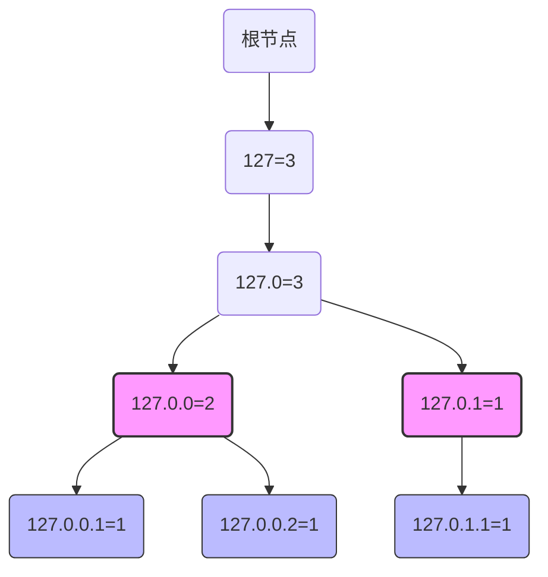

# 字典树

Trie树，即字典树，又称前缀树，是一种树形结构，典型应用是用于统计和排序大量的字符串（但不限于字符串），所以经常被搜索引擎用于文本词频统计。它的优先是，最大限度的减少无谓的字符串比较，提高查找效率。

举例：路由器中有很多很多的IP地址，我想知道某个**网段**下IP地址的数量。恰好网段的定义和IP地址的前缀相对应。使用前缀树是一个很好的做法。

假设需要统计所有 `/24` 网段的 IP 数量（即前 24 位相同的 IP 属于同一子网），有IP地址`127.0.0.1`, `127.0.0.2`, `127.0.1.1`，可以绘制Trie：

