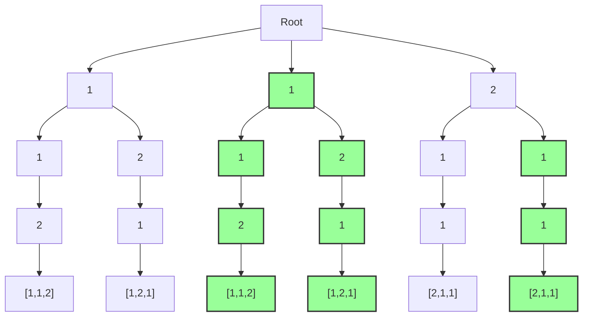

# 递归算法

在思考递归问题的时候，可以思考这3个问题

1. **​终止条件​**​：明确最简单的情况，直接返回结果。例如计算阶乘时 `if n == 0: return 1`
    1. 或者说明确问题的终止情况。
2. **问题拆解**：将当前问题转化成更小的同类问题。例如斐波那契数列 `fib(n) = fib(n-1) + fib(n-2)`
3. **递归假设**：**假设更小的同类问题已经解决之后**，如何从小问题的解推出大问题的解。例如归并排序中合并两个已排序子数组。

## 回溯算法

**回溯法**（Backtracking）是一种通过“试错”来寻找问题解决方案的算法。它常用于解决组合优化问题（如排列、子集、组合、棋盘类问题），核心思想是：**递归地尝试所有可能的选择路径，当发现当前路径无法得到解时，撤销最后一步选择（回溯），尝试其他分支**。

在思考回溯问题的时候，可以在脑中构造一棵搜索树。

### 核心特点

1. **系统性**：穷举所有可能的分支。
2. **剪枝优化**：提前终止不符合条件的分支（如重复值、越界）。
3. **状态重置**：撤销最后一步选择，恢复到之前的状态。

```python
def backtrack(路径, 选择列表):
    if 满足终止条件:
        保存结果（如将路径添加到全局列表）
        return
    
    for 选择 in 选择列表:
        if 不满足剪枝条件:
            做选择（将选择加入路径）
            backtrack(更新后的路径, 新的选择列表)  # 递归进入下一层
            撤销选择（将选择从路径移除）
```

### 一些例子

以[46. 全排列 - 力扣（LeetCode）](https://leetcode.cn/problems/permutations/description/?envType=study-plan-v2&envId=top-100-liked)问题为例。这里的res就是全局结果列表，path对应路径，选择列表就是nums - used。

```python
class Solution:
    def permute(self, nums: List[int]) -> List[List[int]]:
        res = []
        used = [False] * len(nums)  # 记录元素是否被使用过
        
        def backtrack(path):
            if len(path) == len(nums):  # 终止条件：路径长度等于数组长度
                res.append(path.copy())
                return
            
            for i in range(len(nums)):
                if not used[i]:  # 剪枝：跳过已使用的元素
                    used[i] = True      # 做选择
                    path.append(nums[i])
                    backtrack(path)     # 递归进入下一层
                    path.pop()          # 撤销选择
                    used[i] = False
        
        backtrack([])
        return res
```

| 步骤           | 对应代码段                                           | 关键操作            |
| ------------ | ----------------------------------------------- | --------------- |
| ​**​终止条件​**​ | `if len(path) == len(nums)`                     | 保存完整排列          |
| ​**​问题拆解​**​ | `for i in range(len(nums)):`                    | 将问题分解为「选当前+排剩余」 |
| ​**​递归假设​**​ | `path.append(num); backtrack(path); path.pop()` | 动态组合选择与子问题的解    |

以[47. 全排列 II - 力扣（LeetCode）](https://leetcode.cn/problems/permutations-ii/)为例，求的是不重复的所有全排列。以样例`[1,1,2]`为例。用树来表示所有的排列可能性，就是普通的全排列；如果要去除重复的全排列，要剪枝的就是下面的绿色部分。



根据这个图我们不难总结出规律，如果我们**已经在同一层遍历过相同的数**了，就不用再遍历一次了。所以我们可以将`[1,1,2]`排序，然后如果`nums[i] == nums[i-1] && used[i-1]`就剪枝。

```cpp
class Solution {
    vector<vector<int>> r;
    vector<bool> used;
public:
    void bt(vector<int>& nums, vector<int>& p) {
        if (p.size() == nums.size()) {
            r.push_back(p);
            return;
        }

        for (int i=0; i<nums.size(); i++) {
            if (i>0 && nums[i] == nums[i-1] && used[i-1]) {
                continue;
            } // 去掉这个就是普通的全排列
            if (!used[i]) {
                used[i] = true;
                p.push_back(nums[i]);
                bt(nums, p);
                used[i] = false;
                p.pop_back();
            }
        }
    }
    vector<vector<int>> permuteUnique(vector<int>& nums) {
        std::sort(nums.begin(), nums.end());
        used.resize(nums.size(), false);
        vector<int> p;
        bt(nums, p);
        return r;
    }
};
```

以[39. 组合总和 - 力扣（LeetCode）](https://leetcode.cn/problems/combination-sum/description/?source=vscode)为例。这道题看起来可以使用动态规划来解决，但是题目**求的不是方案数量而是所有组合**，动态规划可能导致太高的空间复杂度。下面是回溯的程序，sum用来简化计算，也可以不用这个参数：

```python
class Solution:
    def combinationSum(self, candidates: List[int], target: int) -> List[List[int]]:
        result = []

        def backtrack(path: List[int], sum: int):
            if sum == target:
                result.append(path.copy())
                return
            for num in candidates:
                if num + sum <= target and (len(path) == 0 or num >= path[-1]):
                    path.append(num)
                    backtrack(path, sum+num)
                    path.pop()

        backtrack([], 0)
        return result
```

[40. 组合总和 II - 力扣（LeetCode）](https://leetcode.cn/problems/combination-sum-ii/) 这题和上面很像，很容易想到用搜索+回溯的方法完成。但是题目要求“答案不能包含重复的组合”，所以我在最后用了hash set去重。但是这并不是最好的办法。

```python
class Solution:
    def combinationSum2(self, candidates: List[int], target: int) -> List[List[int]]:
        ret = []
        candidates.sort()
        n = len(candidates)

        def dfs(path, i, s):
            if i == n:
                if s == target:
                    ret.append(tuple(path))
                return
            
            path.append(candidates[i])
            dfs(path, i + 1, s + candidates[i])
            path.pop()
            dfs(path, i + 1, s)

        dfs([], 0, 0)
        return list(set(ret))
```

为了完成去重，可以**将相同的数放在一起进行处理**，也就是说，如果数 x 出现了 y 次，那么在递归时一次性地处理它们，即分别调用选择 0,1,⋯,y 次 x 的递归函数。

```python
class Solution:
    def combinationSum2(self, candidates: List[int], target: int) -> List[List[int]]:
        ret = []
        nums = defaultdict(lambda: 0)
        for i in candidates:
            nums[i] += 1
        nums = list(nums.items())
        n = len(nums)

        def dfs(path, index, s):
            if index == n:
                if s == target:
                    ret.append(path.copy())
                return

            dfs(path, index + 1, s)
            most = min((target-s) // nums[index][0], nums[index][1])
            for i in range(1, most+1):
                path.append(nums[index][0])
                dfs(path, index + 1, s + nums[index][0]*i)
            for i in range(most):
                path.pop()

        dfs([], 0, 0)
        return ret
```

这是华为机考的[走迷宫问题](https://www.nowcoder.com/practice/cf24906056f4488c9ddb132f317e03bc)。经典的使用回溯的例子。我们使用上面的三步拆解这个问题：

```python
def find_path(maze):
    h, w = len(maze), len(maze[0])
    visited = [[False for _ in range(w)] for _ in range(h)]
    path = []
    
    def dfs(i, j):
        # 1. 终止条件
        if i == h - 1 and j == w - 1:
            path.append((i, j))
            return True
        
        # 2. 问题拆解：尝试四个方向
        directions = [(-1, 0), (1, 0), (0, -1), (0, 1)]
        for di, dj in directions:
            ni, nj = i + di, j + dj
            # 检查新位置是否合法
            if 0 <= ni < h and 0 <= nj < w and maze[ni][nj] == 0 and not visited[ni][nj]:
                visited[ni][nj] = True  # 标记已访问
                # 3. 递归假设：假设 dfs(ni, nj) 能解决子问题
                if dfs(ni, nj):
                    # 4. 结果组合：将当前点加入路径
                    path.append((i, j))
                    return True
                visited[ni][nj] = False  # 回溯（本题唯一路径可省略）
        return False
    
    dfs(0, 0)
    path.reverse()  # 路径是从终点回溯的，需要反转
    return path

```

| 步骤           | 对应代码段                           | 关键操作                |
| ------------ | ------------------------------- | ------------------- |
| ​**​终止条件​**​ | `if i == h - 1 and j == w - 1:` | 走到迷宫终点，返回True       |
| ​**​问题拆解​**​ | `for di, dj in directions:`     | 将问题分解为4个子问题         |
| ​**​递归假设​**​ | `if dfs(ni, nj):`               | 如果子问题能解决，那么将当前点加入路径 |

一道原汁原味的数独题：[Sudoku\_牛客题霸\_牛客网](https://www.nowcoder.com/practice/78a1a4ebe8a34c93aac006c44f6bf8a1)

```python
import sys

def main():
    sudoku = []
    spaces = []
    for line in sys.stdin:
        a = [int(n) for n in line.split()]
        sudoku.append(a)
    for i in range(0,9):
        for j in range(0,9):
            if sudoku[i][j] == 0:
                spaces.append((i,j))
    
    def legal(x,y,num):
        for i in range(0,9):
            if sudoku[x][i] == num or sudoku[i][y] == num:
                return False
        for i in range(0,3):
            for j in range(0,3):
                if sudoku[x // 3 * 3 + i][y // 3 * 3 + j] == num:
                    return False
        return True

    def solve(n) -> bool:
        if n == len(spaces):
            return True
        x, y = spaces[n]
        for num in range(1,10):
            if legal(x,y,num):
                sudoku[x][y] = num
                if solve(n+1):
                    return True
                sudoku[x][y] = 0
        
    def output():
        for i in range(0,9):
            for j in range(0,9):
                print(sudoku[i][j], end = ' ')
            print()

    solve(0)
    output()
    
main()


```

## 参考链接

[13.1   回溯算法 - Hello 算法](https://www.hello-algo.com/chapter_backtracking/backtracking_algorithm/#1312)
