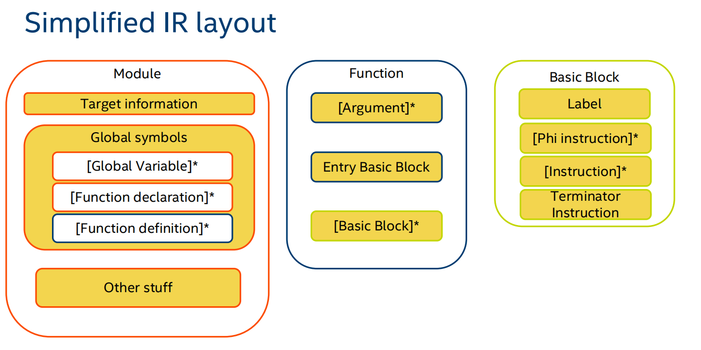

# LLVM

## LLVM-IR

LLVM-IR，即 LLVM 中间代码，有三种表示方式，他们互相之间是等价的。

1. 内存中的 LLVM IR （为了编译器快速处理）
2. ⽐特码形式的 LLVM IR （为了给方便给 JIT complier 使用）
3. 可读形式的 LLVM IR （为了给人看）

回忆编译原理的内容，我们完成语法分析和语义分析，生成了抽象语法树 AST 时，下面我们想要生成中间代码。LLVM-IR 就是一种中间代码。根据 AST⽣成对应的 LLVM IR，这也就是编译器前端所做的事，编译器后端则是将 LLVM IR 转换成具体的机器语言。所以 LLVM-IR 是沟通前后端的桥梁。如果我们想要写一个编译器，那么我们完成前端部分生成 LLVM-IR，后端部分就不用我们自己动手了。这也是当代一些新语言的做法，例如Rust。

下面这个图很好的展现了 LLVM-IR 的构造。

- Module：可以认为 Module 是 LLVM 的编译单元。
  - Global Variable：全局变量。
  - Function declaration：函数声明。
  - Function definition：函数定义。
    - Argument：函数的参数
    - Entry Basic Block：函数入口
    - Basic Blocks：Basic block 满足下面两个条件的指令序列，所以你可以认为 BasicBlock 是相对于控制流的基本单元。
      1. 控制流只能从 BasicBlock 的 **第一个指令** 进入该块。
      2. 除了 BasicBlock 的最后一个指令（Terminator Instruction），控制流在离开基本块之前不会跳转或停机

## LLVM Pass

LLVM Pass 是最有意思的内容了。

#TODO 

----

参考链接：

- [LLVM-IR-tutorial](https://llvm.org/docs/tutorial/index.html): 看一遍，大概了解 LLVM 汇编的写法和基本思想。
- [inkwell的文档](ttps://thedan64.github.io/inkwell/inkwell/index.html): rust binding, 我更熟悉一点，了解接口。
- [LLVM-Program-Manual](https://llvm.org/docs/ProgrammersManual.html): 我比较喜欢这里的对类的总体性介绍。
