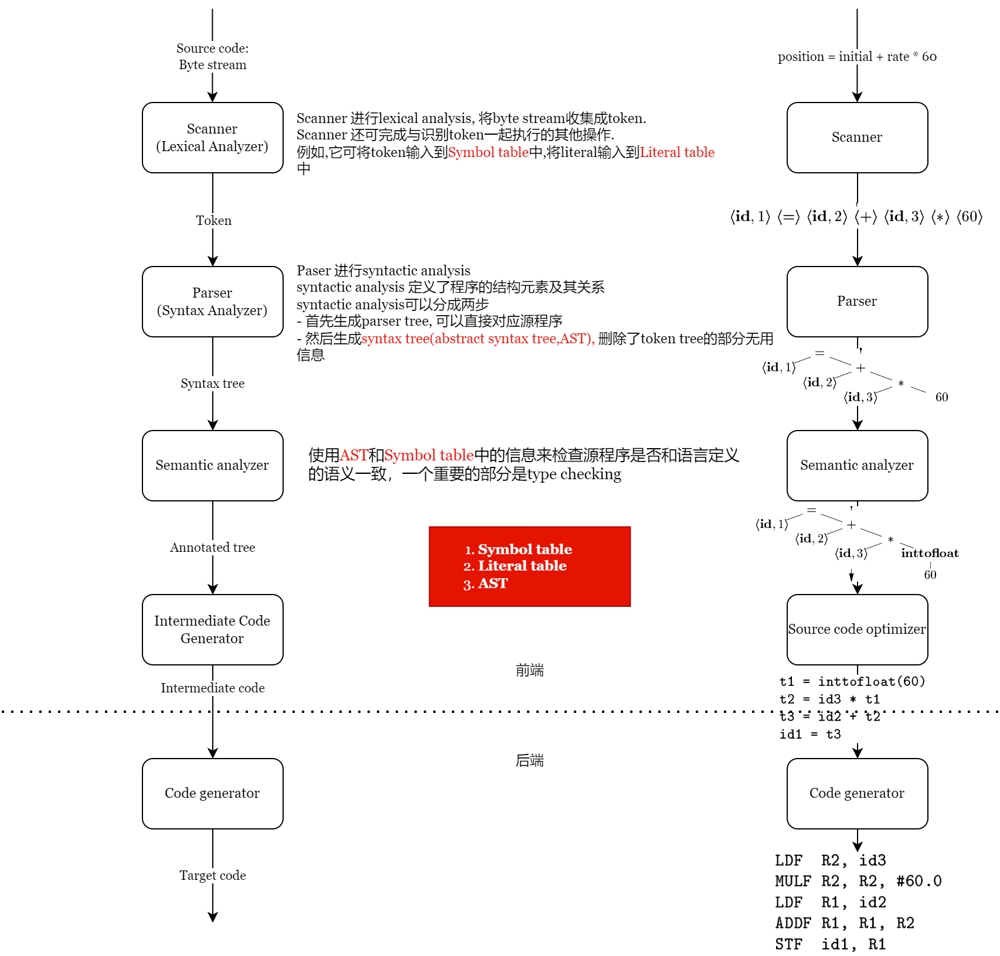
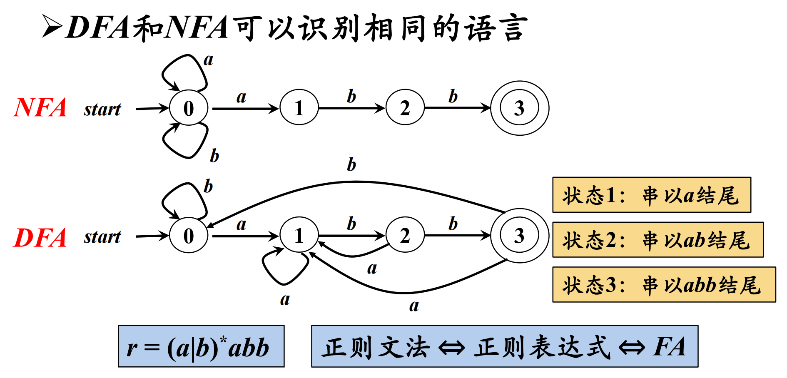

# Compiler

编译的大致的流程如下。下图忽略了代码优化的部分，代码的优化可以发生在各个阶段。



编译过程可以大致分为前端和后端。前端主要是将源代码变成中间代码，后端主要是优化以及生成目标机器码。浙江大学的《编译原理》课程主要讲前端，前端更像一些字符串处理的理论。后端则较少的涉及，后端更接近程序分析。

## Lexical Analysis

**词法分析（Lexical Analysis）** 的主要任务是读入源程序的输入字符，将他们组成 lexemes，生成并输出一个 token 序列（token 和 lexeme 一一对应）。通常，这需要识别 lexemes，过滤注释和空白。

Lexical Analyzer 通常还要和 Symbol table 进行交互，发现标识符时添加到 Symbol table。

有三个概念需要了解。**alphabet** 是有限符号的集合。**string** 是符号的有穷序列。**language** 是给定 **alphabet** 上任意可数的 **string** 的集合。

### Regular Expression

正则表达式（Regular Expression, Regex）采用归纳定义：

- 归纳基础：

  1. 空串 `ε` 是一个正则表达式。`L(ε) = {ε}`
  2. 若 `a` 是 `∑` 上的一个符号，那么 a 是一个正则表达式。`L(a) = {a}`

- 归纳步骤：如果 r,s 都是正则表达式，那么

  1. `(r)|(s)` 是正则表达式，表示语言 `L(r) ∪ L(s)`
  2. `(r)(s)` 是正则表达式，表示语言 `L(r)L(s)`
  3. `(r)*` 是正则表达式，表示语言 `(L(r))*`
  4. `(r)` 是一个正则表达式，表示语言 `L(r)`，这是为了说明括号是没用的。

可以用正则表达式定义的 language 叫做 **regular set**。为了避免不必要的括号，规定优先级的顺序是 `*` > 连接 > `|` 。

> 正则表达式是存在局限性的，比如他没有计数的功能，他不能匹配类似 `n个a b n个a` 这样的串。

### Finite Automata 

有穷自动机（Finite Automata）分为两种：

- DFA (Deterministic Finite Automata): 对每一个 **状态和输入字符**，有且只有一个 **下一个状态**。
- NFA (Non-Deterministic Finite Automata): 对于相同的当前状态和输入字符，下一个状态不一定是唯一的。

举例：我们通常使用 **transition graph** 来表示有穷自动机。



- NFA 和 DFA 具有 **等价性**。对任何非确定的有穷自动机 N ，存在定义同一 language 的确定的有穷自动机 D，对任何确定的有穷自动机 D ，存在定义同一 language 的非确定的有穷自动机 N。
- 对于任何给定的 DFA，都有一个含有最少量状态的等价的 DFA，而且这个最小状态的 DFA 是唯一的。

### Regex -> NFA -> DFA

如果你的直觉足够好，或者有相关的知识储备，你可以看出实际上我们可以用有穷自动机来匹配正则表达式。使用 **McNaughton-Yamada-Thompson 算法**，我们可以将Regex 转化为 NFA。这个算法的思路是非常简单的，如下图所示：


将NFA 转化为 DFA，可以使用**子集构造算法**。首先了解三个重要的概念（集合），在下面的伪代码会把他们当做函数。

- 状态的 `ε-closure(s)`。由一个状态 s 出发，可以经过若干个 `ε` 转换能到达的状态的 **NFA 状态集合**。
- 状态集合的 `ε-closure(T)`。从 **集合 T 中的** 某一个状态出发，可以经过若干个 `ε` 转换能到达的状态的 **NFA 状态集合**。
- `move(T, a)`。从集合 T 中的某个状态出发，可以通过 `a` 转换能够到达的 **NFA 状态集合**。

然后是构造 DFA 状态转换图。**DFA 状态集合**，记做 `Dstates`（也就是图的点），**DFA 状态转换关系**，记做 `Dtran`（也就是图的边）。下面是该算法的 **Rust 伪代码**。

```rust
let Dtran = map!();
let Dstates = set!(ε_closure(start),);
let untag = deque!(ε_closure(start),);
while !untag.is_empty() {
  let T = untag.pop_front();
  for symbol in alphabet {
      let U = ε_closure(move(T,symbol));
      if Dstate.insert(U) {  // DFA增加了一个状态
          untag.push_back(U);
      }
      Dtran.insert( (T,U) ) = a; // 表示 T ---a--> U
  }
}
//  因为当前状态 + 输入字符和下一个状态一一对应，所以即使在 NFA 中没有对应的输入（即下一个状态是空集），DFA 中也应该创建一个状态来表示这个空状态。
```

DFA状态最小化：画出DFA状态转移表后，对于那些在任意相同输入下产生相同输出的状态进行合并。

## Syntax Analysis

**语法分析（Syntax Analysis）** 从 词法分析 获得一个 Token Stream。语法分析器的工作是根据 Token Stream 构造出一个语法分析树，将它传递给编译器的其他部分进一步处理。语法分析器大致分为通用的、自顶向下的和自底向上的，而通用的因为效率太低不被使用，下面会介绍后二者，**自顶向下分析** 和 **自底向上分析**。

### Context Free Grammar

首先了解 **文法 Grammar** 的概念。文法是形式语言中字符串的一套产生式规则。这些规则描述了如何用语言的字母表生成符合语法的有效的字符串。文法不描述字符串的含义，也不描述在任何上下文中可以用它们做什么——只描述它们的形式。

**Grammar**: `G=(Vt,Vn,P,S)`。意思是说，一个 Grammar 由下面四个元素组成：

1. 一个 **终结符号 (terminal symbol)**集合，有时也叫**词法单元 (token)**。
2. 一个**非终结符号 (nonterminal symbol)**集合，又是也叫语法变量。每个非终结符号表示一个终结符号串的集合。
3. 一个产生式 (production) 集合。
4. 指定一个非终结符号位 **开始符号 (start symbol)**。开始符号表示的是该 Grammar 中最大的语法成分。

例如：`stmt -> if (expr) stmt else stmt` 这样的规则叫做 **production**，`if` 和 `()` 被称为 **terminal symbol**，`expr` 和 `stmt` 这样的变量表示终结符号的序列，称为 **nonterminal symbol**。`stmt` 就是 **start symbol**。

**上下文无关文法 Context Free Grammar** 指的是 **产生式左侧只能包含一个符号，并且该符号为非终结符号的文法**。这个限制是非常重要的。

> 事实上一共有四种文法，逐级限制。对于α→β：
> 
> - 0 型文法：α中至少包含 1 个非终结符
> - 1 型文法（CSG 上下文有关） ：｜α｜≤｜β｜
> - 2 型文法（CFG 上下文无关文法） ：α ∈ 非终结符
> - 3 型文法（RG 正则）：A→wB 或 A→w (A→Bw 或 A→w) A/B 代表非终结符
> 
> 程序设计语言的语法通常是 **CFG**，通常用 **RG** 匹配 Token。

还有一些非常重要的概念需要了解：

- **推导（Derivation）**：简单的说，就是把 production 的右部替换成左部，只替换 1 次就是 directly derive。记做 $\Rightarrow^0$，若干次替换记做 $\Rightarrow^*$。相反的过程就是 **归约 Reduction**。parsing tree 是推导的图形化表示。
- **语言（Language）**：由 grammar `G` 的 start symbol `S` 推导出的所有 sentence 构成的集合称为 grammar`G` 生成的 language，记为 `L(G)`。`L(G) = {w /S =>*, w ∈ Vt*}`。要证明一个 Language 和 Grammar 对应，需要证明 Grammar 所有能产生的 sentence 都属于 Language，Language 中所有的 string 都能被 Grammar 产生。
- **二义性（Ambiguous）**: 若 grammar 对同一 sentence 可以产生不止一棵 parsing tree，则称 G 是 ambiguous。要改写二义性文法为非二义性文法
  - 划分优先级和结合性
  - 引入一个新的非终结符，**增加一个子结构并提高一级优先级**（优先级的判断）
  - **递归非终结符在终结符左边，运算具有左结合性，否则具有右结合性**。

回顾一下，Syntax Analyzer 的作用是生成 AST 或 Parsing Tree。其实 parsing tree 是推导的图形化表示。AST 则是精简的 Parsing Tree，一般我们生产 AST。

现在我们手头有一个 Token Stream。那么我们如何进行推导呢去构建 parse tree 呢？主要有两个问题：**换哪个 nonterminal symbol? 用哪条 production?**。常用的有两种办法：

1. 在 **Left-most Derivation** 最左推导中，总是选择每个句型的最左 nonterminal symbol 进行替换。这个和 **top-down parsing** 一起使用，也就是从 Parse Tree 的顶向下分析。**左句型 (left sentential form)**是指推导至该句子的全部左推导。
2. 在 **Right-most Derivation** 最右推导中，总是选择每个句型的最右 nonterminal symbol 进行替换，最右推导也被称为 **规范推导**。这个和 **down-top parsing** 一起使用，也就是从 Token Stream 向上构造 Parse Tree。**右句型 (right sentential form)** 是指推导至该句子的全部右推导。

#TODO 
