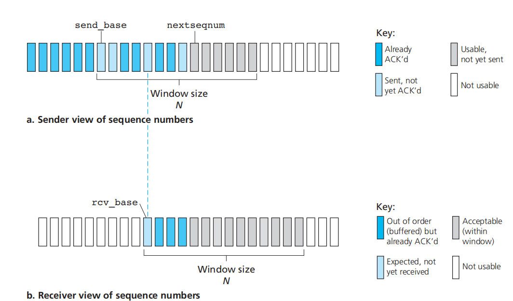

# 流量控制和拥塞控制

拥塞（Congestion）：网络中存在太多的数据包导致数据包被延迟和丢失，降低了传输性能，这种情况称为拥塞。网络层和传输层共同承担处理拥塞的责任。控制拥塞的最有效方法是减少传输层注入网络的负载。拥塞产生最严重的后果是死锁。

值得指出的是 **拥塞控制** 和 **流量控制** 之间有很大的差异，它们之间的关系非常微妙。

- 拥塞控制的任务是确保网络能够承载所有到达的流量。这是一个全局性的问题，涉及各方面的行为，包括所有的主机和所有的路由器。
- 流量控制只与特定的发送方和特定的接收方之间的点到点流量有关。它的任务是确保一个 **快速的发送方不会持续地以超过接收方接收能力的速率传输数据**。

## 网络层拥塞控制

拥塞的出现意味着负载（暂时）大于资源（在网络的一部分〉可以处理的能力。很自然人们能想到两个解决方案：增加资源或减少负载。

1. 给路由器、链路升级，增加带宽。
2. 流量感知的路由，根据每天的流量模式定制路由。
3. 准入控制。在虚电路网络中，可以选择拒绝新连接的建立减少负载。
4. 流量调节。路由器监控使用的资源，确定合适快要接近拥塞，然后将反馈消息传递给造成拥塞的发送方。
5. 负载脱离。当以上任何 种方法都无法消除拥塞时，路由器可以亮出它的杀手铜，即负载脱落，把某些数据包丢弃。对于要丢弃哪些数据包，有不同的策略。

## TCP 拥塞控制

UDP 是没有拥塞控制的。我们来看看 TCP 拥塞控制的方法。TCP 会不断的探索拥塞窗口 `cwnd`。整个过程被概括为“慢启动、拥塞避免、快速回复”（下面的第三张图 ）

**慢启动**：TCP 在刚建立连接完成后，首先是有个慢启动的过程，这个慢启动的意思就是一点一点的提高发送数据包的数量。

以一个较小的值开始，1 个 MSS。当被确认（收到 ACK）的时候

- 如果还没有达到 `ssthresh` 的阈值，`cwnd` 翻倍。
- 如果达到了 `ssthresh` 的阈值，那么 `cwnd++`，这个过程叫做拥塞避免，因为减缓了发送速度。

当我们收到三个重复的确认的时候，说明已经开始丢包了（但还不是特别严重。为什么呢？回顾[TCP](TCP.md)协议）。**可能** 是拥塞导致的，这个时候我们进行快速恢复：

- `cwnd/=2`，`ssthresh` 也被设置为这个值。
- 拥塞窗口 `cwnd = ssthresh + 3` （ 3 的意思是确认有 3 个数据包被收到了）；
- 重传丢失的数据包；
- 如果再收到重复的 ACK，那么 cwnd 增加 1；
- 如果收到新数据的 ACK 后，把 cwnd 设置为第一步中的 ssthresh 的值，原因是该 ACK 确认了新的数据，说明从 duplicated ACK 时的数据都已收到，该恢复过程已经结束，可以回到恢复之前的状态了，也即再次进入拥塞避免状态；

如果我们发现发送包超时了，这时我们进行慢启动（下面的第一张图）：

- `ssthresh` 设置成 `cwnd/2`， `cwnd=1`。

之后继续按照上面的规则增加 `cwnd`，重复上面的过程。

## 流量控制协议

流量控制要处理的问题是：**发送的速度太快而接受的速度太慢**。如果一直无脑的发数据给对方，但对方处理不过来，那么就会导致触发重发机制，从而导致网络流量的无端的浪费。

- 发送窗口：发送方维持一组连续的允许发送的帧的序号。
- 接收窗口：接收方维持一组连续的允许接收的帧的序号。

事实上，通过确认、超时重传、编号、校验，实现了 **可靠传输**。

### Stop and Wait

顾名思义，发送方发送数据包之后，直到收到ACK包才发送下一个。这算法显然只存在教科书中。

可能出现的意外情况。

- 第一种，如果 Sender 发送的包丢失了。Sender 在很久之后没有收到 ACK 会选择重发。
- 第二种，如果 Receiver 发送的 ACK 丢失了。Sender 在很久之后没有收到 ACK 会选择重发。那 Receiver 就很迷惑了，这个包是哪个？是新的包，还是旧的包？所以我们需要 **给包编号**，对于 Stop and Wait，1 bit 的就够了（这也是下面 GBN 公式 N=1 的情况）。

你也可以认为 stop and wait 就是 **发送窗口（send window, swnd）** 和 **接收窗口（receive window, rwnd）** 大小都是 1 的 GBN。

### Go back N (GBN)

在GBN协议中，允许发送方发送多个分组而不需要等待确认。但是在流水线中未确认的分组数不能超过某个最大的允许数$N$（即发送窗口大小$W_t$）。我们将 $base$ 定义成 **最早未确认的分组的序号**。将 $nextseqnum$ 定义成最小的未使用序号。  

采用**累积确认**的方式，**ACK=N表示接收方已经收到N号帧和它之前的全部帧**。所以，如果Receiver收到了1345但是没收到2，只会发送ACK=1并**丢弃3、4、5**；如果Sender只收到了ACK(1),ACK(3),ACK(5)，Sender知道其实1、2、3、4、5都已经被接收成功了，下一个发送6。

如果出现超时，发送方重传所以已发送但未被确认的帧。类似的，超时可能是发送的数据丢失或者ACK丢失。

采用N个比特对frame进行编号，那么**发送窗口的尺寸**满足$1\le W_t \le2^n-1$。否则就无法区别旧帧和新帧。接收窗口大小为1。

### Selective repeat protocol (SR)

GBN和SR都属于**连续ARQ协议**。

回顾：在GBN算法中，如果收到了1345但是没收到2，只会发送ACK=1并丢弃345。

GBN直接丢弃了失序的包，也是一种浪费。我们想只重传出错的帧。**究其原因，是因为接收方窗口大小为1，对于不按序到达的包没有地方缓存**。所以SR接收方窗口大于1 。

也是采用累积确认的方式，**ACK(N)表示接收方已经收到N号帧和它之前的全部帧**。只不过以上面的例子，我在收到2之后就直接发送ACK=5了，因为我已经把3、4缓存了。

发送窗口和接受窗口的尺寸要满足$W_T \le 2^{n-1}$，否则也是无法区分新包和旧包。一般情况我们认为发送窗口和接受窗口是一样大的。

> 具体解释，是
> 
> 1. $rwnd+swnd \leq 2^n$
> 2. $swnd \geq rwnd$
> 
> 设想这样一个场景，3bit，发送窗口为 5，接受窗口为 4。
> 
> 发送方发送 0,1,2,3,4，接受者都收到了，返回 ACK(4)，移动接受窗口，等待 5,6,7,0。结果 ACK 丢了，发送方重传了 0。
> 
> 所以接收方就把老 0 当新 0 了，这就是所谓的分不清旧帧和新帧。

## TCP 流量控制

TCP使用的算法和SR算法很接近了，但是实现上还是有细节的优化。

- 在通信的过程中，接收方根据自己接收缓存的大小，动态的调整**接收窗口**的大小（头部的窗口大小字段）。发送方的发送窗口取$min(rwnd,cwnd)$，即接收窗口和拥塞窗口的较小者。
- TCP使用累计应答的方式。这一点与连续ARQ类似。
- TCP在接收端会设置缓存，来缓存正确接收但是失序的分组，这点与SR类似。（实际上TCP RFC并没有对接收端要怎样处理失序到达的分组提出要求，但是在接收端设置缓存是实践中大家都采用的方法）
- TCP使用快速重传机制：如果收到对于一个特定报文段的3个冗余ACK，则在超时事件发生前就会对该报文段进行重传，这大大节约了时间。
- 注意：TCP中的ack是指接收端希望从发送端收到的下一字节的序号。这个和之前介绍的略有不同，但是实现的效果是类似的的。例如发送端发送了编号为0-5的字节，这时接收端成功接收后就会发送ack为6。
- 对于最后0窗口的情况，为了避免“死锁”，会计时。如果超时了还没有收到窗口不为0的通知，会发送**探测报文段**。

## 链路层流量控制

网络层需要流量控制吗？ 网络层点对点之间的传输，其实还是经过链路层的。所以 IP 协议里没有流量控制。

那么链路层流量控制有什么办法呢？就是上面的办法。

----

Reference:

- <https://xiaolincoding.com/network/3_tcp/tcp_feature.html#%E5%BF%AB%E9%80%9F%E6%81%A2%E5%A4%8D>
- CS114
