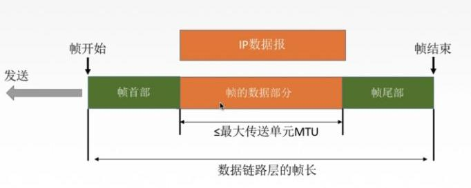

# Link Layer

对学计算机的同学来说，链路层（Link Layer）可能是最不重要的了，那是网工需要关心的事情。

## 链路层功能概述

链路层的功能可以概括为以下几点：

1. 为网络层提供服务：分为无确认无连接服务（比如以太网），有确认无连接服务（无线通信常用），有确认面相连接服务。
2. 链路管理：对于面向连接的服务，需要管理连接的建立、维持、释放；在多个站点共享同一物理信道的情况下，如何在要求通信的站点间 **分配和管理信道** 也是链路管理的范畴。
3. 组帧（Framing）：两个主机传送消息的时候是把网络层的分组 **封装成帧**，以帧的格式进行传输的。那么如何封装，如何定界就是问题了。
4. 流量控制：由于收发双方的工作速率和缓存空间的差异，可能出现发送方的发送能力大于接收方的接收能力的情况。这个时候我们要限制发送方的发送速率，否则前面来不及接收的帧会被后面不断发送的帧淹没。详见 [拥塞控制和流量控制综述](https://www.jianguoyun.com/static/stackedit/Congestion%20Control%20and%20Flow%20Control.md) 这篇文章。
5. 差错纠正和检测，链路层的检测主要是为了提高上层的传输效率，详见 [[Error Control]] 这篇文章。

## 组帧 Framing

**帧（Frame）**： 链路层的 **协议数据单元 (Protocol Data Unit,PDU)**。（网络层的协议数据单元叫分组 Packet，传输层的协议数据单元叫 Message，TCP 的协议数据单元叫 Segment）

链路层的传输数据块叫做帧。是对 IP 分组的简单包装，在**IP分组（packet）** 的前后添加一些字段，帧首部和帧尾部。  
首部和尾部包含许多的控制信息，还可以做到定界的作用。好的设计方案必须使接收方很容易发现一个新帧的开始，使用的信道带宽要少。元信息中还可能包括校验信息。我们要解决的主要问题是帧定界，帧同步，透明传输。

通常有下面四种方法实现组帧，一般使用后面两种。

1. 字节计数法：字节计数法是在帧的头部使用一个计数字段来标明帧内字符数。目的节点收到字节计数值之后就知道后面跟着的字节数，就可以确定帧的结束位置。这个的最大问题是一旦字节计数值出错，就无法判断这个帧的结束和下个帧的开始，收发双方失去同步。
2. 字节填充的标志字节法（如 PPP 协议使用的）：使用特定字符来定界一帧的开始和结束。有一个可能的问题，就是传输的数据中出现了控制字符。所以我们要防止这种情况的发生。也就是说，无论数据是什么都应该能正常的传输, 就好像数据是透明的一样。这就是 **透明传输**。在字节填充法中，我们用转义符的方式实现（就好像C语言的字符串字面量中出现 `"`，要用 `\"` 代替一样）
3. 比特填充的标志比特法：也是使用特定字符来定界一帧的开始和结束。
    1. （ 5"1"1"0" 法）：比如开始和结束的标志是 01111110。对应的透明传输方案是，我们在对数据进行封装的时候，遇到连续的 5 个 1 就填充一个 0，解封装的时候遇到连续的 5 个 1 就删除后面的 0。在遇到连续的六个 1，我们就知道到达了边界了，这种方法很适合用硬件来实现。
4. 物理层编码违禁法：比如曼彻斯特编码只有 “高低”和“低高”，所以我们就可以用“高高”和“低低”作为控制字符。IEEE802 标准采用这种办法。
