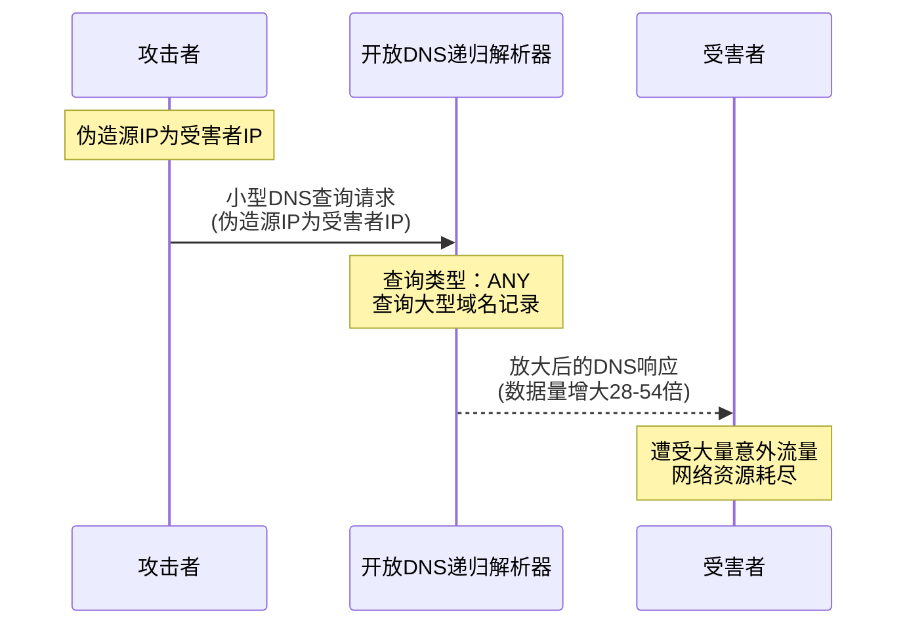

# 网络安全

## 攻击

### IP spoofing

IP spoofing指的是**在发送数据包时修改源IP地址字段，使其显示为非真实的源IP**。

- 主要用于UDP和ICMP等**无连接**协议的通信
- 在基于TCP的通信中较难实现完整的会话劫持，因为TCP需要三次握手建立**连接**

常见用途：

- DDoS反射放大攻击
- 隐藏真实身份，逃避追踪
- 绕过基于IP的访问控制列表
- 在某些情况下绕过防火墙规则

### DNS放大攻击

DNS攻击借助IP spoofing技术，通过较小的代价实现DDoS攻击。

我们不难观察到，基于UDP的应用层服务容易成为DDoS放大攻击的首选目标。

- **无连接特性**：UDP不需要建立连接，使IP伪装变得简单可行，攻击者可以轻松欺骗源IP地址
- **无需验证**：许多基于UDP的服务在响应请求前不验证发送者的真实身份
- **放大效应**：小型请求往往触发大型响应，提供显著的流量放大倍数
- **普遍部署**：许多易受攻击的UDP服务在互联网上大量存在

除了DNS 协议，还可以借助 Memcached, NTP，DNS，SSDP，QUIC，原理都大同小异。

如何防御呢？

0. 从基础设施来讲，路由器应该过滤这些伪造自己 Source IP 的数据包
1. 关闭不必要的UDP服务，限制DNS，NTP等服务等响应大小，限制速率。

### TCP SYN洪水
